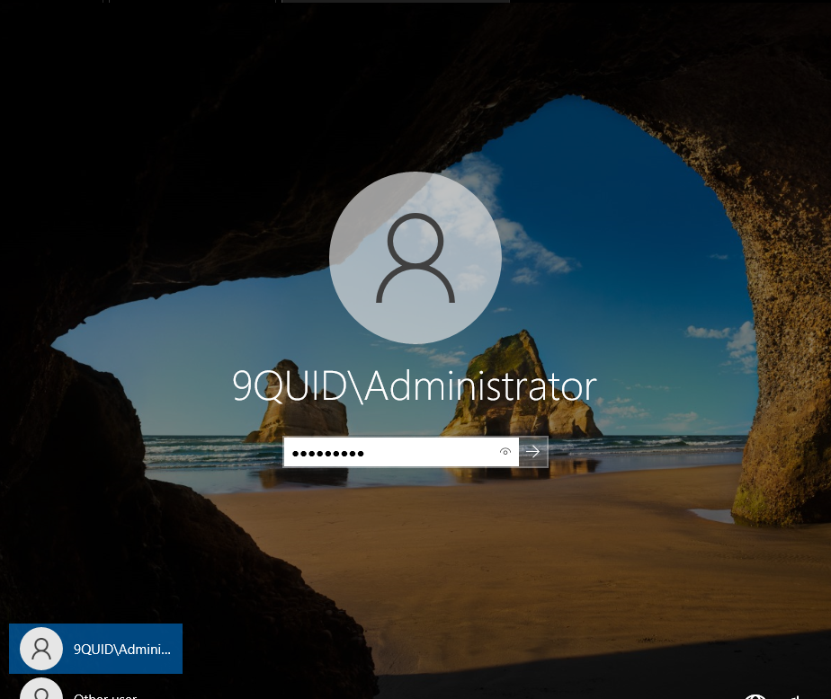
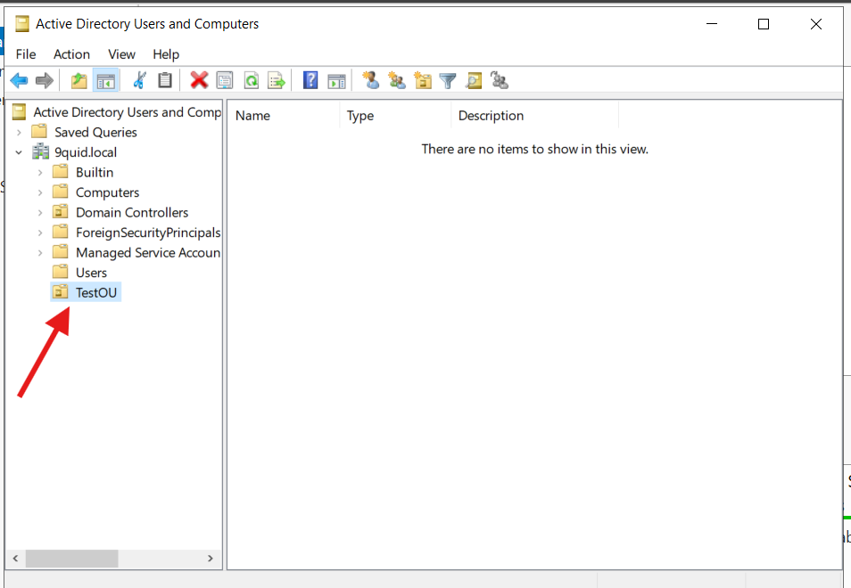
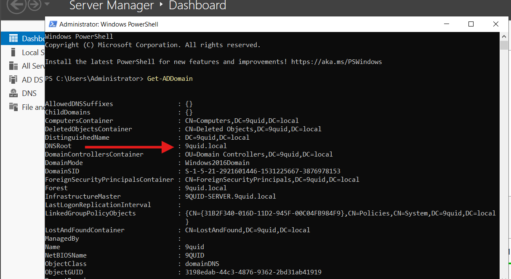

# Active Directory Domain services set-up

## Introduction

In this lab, I set up Active Directory Domain Services (AD DS) on Windows Server 2022.

AD DS is the core directory service for Windows domain networks. It provides centralized management of users, computers, groups, and security policies, and it authenticates and authorizes all users and devices within a domain.

I installed the AD DS role, promoted the server to a Domain Controller, and verified functionality by creating and testing an Organizational Unit (OU).

## Objectives

The goal of this lab was to install and configure Active Directory Domain Services (AD DS), promote the server to a Domain Controller, and confirm its functionality in the domain environment.

### Step 1: Install Roles & Features

Opened Server Manager, clicked on `Manage` selected `Add Roles and Features`.

***The figure above shows added roles and features***

Then completed the wizard and installed `AD DS`.

***The figure above shows the successful installation of the AD DS role***

### Step 2: Promote Server to Domain Controller

After installing AD DS, I went on to promote the server to a Domain Controller.

> **Note:** At this stage, I took a snapshot of the system to preserve its current state before promotion.

***The figure above shows server promotion***

### Step 3: Verify Server has been promoted to Domain Controller

At this stage after promoting the server to Domain Controller, the server rebooted and all modifications were applied successfully.

***The figure above shows server as a domain controller***

### Step 4: Test Domain Controller Functionality

To ensure the Domain Controller is fully working , I created an Organizational Unit as seen below.

***The figure above shows a test OU***

## Useful Commands

### Verify Domain Controller Installation (PowerShell)

- `Get-ADDomain`
- `Get-ADForest`

**Figure shows DC fully functioning**

### Lessons Learned

- Snapshots are your best friend. Take regular snapshots to save rollback in case of any misconfigurations.

- DNS is tightly integrated: AD DS setup automatically installs/configures DNS, and allows promotion to be successfull.

- After promotion a reboot is mandatory.

- OU creation is a quick test. Creating an OU  is a simple way to confirm DC is working properly.

- Patience during promotion. The wizard takes a while and can look stuck but letting it finish is the way to go.
