# DNS and DHCP configuration

## Introduction

`DNS (Domain Name System)`: It is a service that translates human-readable names such as `www.example.com` into IP addresses like `192.168.1.10`. Active Directory uses it to locate domain controllers and services. It runs on port `53 UDP`

`DHCP (Dynamic Host Configuration Protocol)`: A service that automatically assigns IP addresses, subnet masks, default gateways, and DNS servers to clients. This reduces manual configuration and ensures consistent network settings. It uses port `67 UDP` for the server to listen for requests and port `68 UDP` for the client to listen for responses.

## Objectives

The goal of this lab was to install and configure DNS and DHCP, create the necessary zones and scopes, and test that client machines could receive IP addresses and resolve names correctly.

### Step 1 DNS setup

DNS, as earlier explained, helps resolve hostnames to IP addresses and vice versa. To achieve this, DNS uses different types of `resource records` that serve specific purposes. Below are some of the most common DNS records:

## Common DNS Records  

| Record Type | Function |
|-------------|----------|
|`A (Host)`     | Resolves hostnames to `IPv4 addresses` |
| `AAAA (Host)` | Resolves hostnames to `IPv6 addresses` |
| `PTR (Pointer)`| Resolves `IP addresses to hostnames` (reverse lookup) |
| `MX`          | Identifies `mail servers` for a domain |
| `CNAME (Alias)`| Maps an alias name to a `canonical (true) domain name` |
| `NS`          | Specifies the `authoritative name servers` for a zone |
| `SRV`        | Identifies servers providing `specific services` (e.g., AD DS, Kerberos) |

**Note: When setting up `Active Directory Domain Services (AD DS)`the DNS role is installed by default**.
  
- By default, only `Forward Lookup Zones`(resolves hostnames to IP) are created automatically.
  
- If you need `Reverse Lookup Zones` (to resolve IP addresses back to hostnames) you have to configure them manually.

**Figure shows a forward record**

I set up a reverse lookup zone just out of curiosity, it’s not required for a basic lab, but it’s fun to see how IPs can flip back into names, like when I will explore Internet Information Serive (IIS)

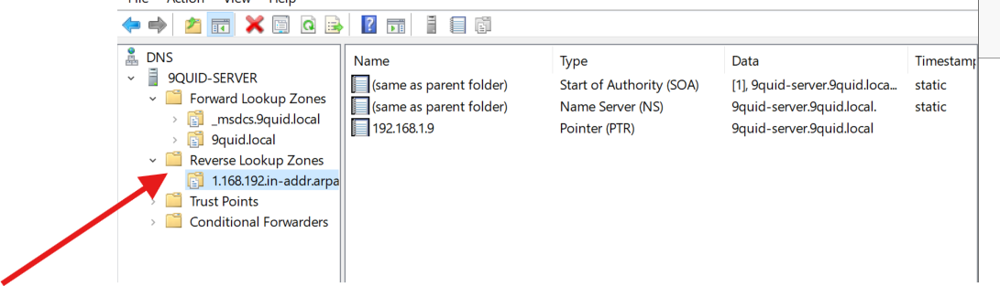

**Figure shows a reverse record**

### Step 2 DHCP Configuration

DHCP stands for Dynamic Host Configuration Protocol. It allows for automatic IP assignment which reduces manual efort and potential errors. It does this in a process called `DORA`
  
- `Discover`: Here, when a client device joins the network, it sends a broadcast requesting for an IP address.

- The DHCP server responds with an `Offer` of the IP configurations (IP, subnet mask, gateway and other information)

- `Request`: Here, the Client accepts the offer from the DHCP server with a DHCP Request.

- `Ack`: Finaly the DHCP asigns the IP information to the client.

Below are the steps to configure a DHCP Server

### Step 1 Install DHCP

On the Server Manager dashbord, I went to the top right click on `Manage` then `Add roles and features` then select DHCP. Then completed the setup wizared as shown below.

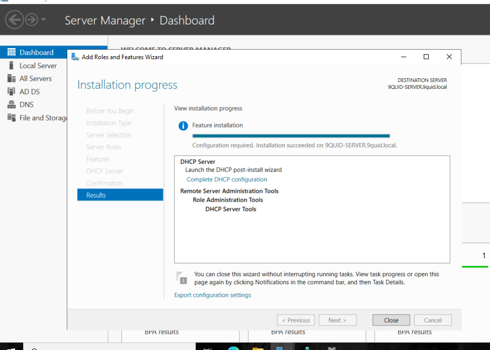

**Figureshows DHCP setup wizard**

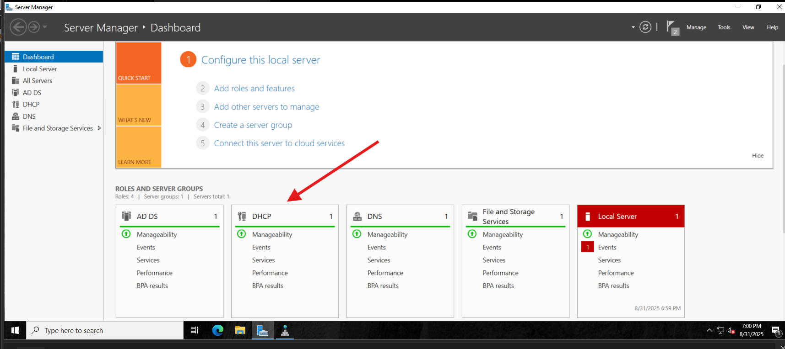

**Figure shows DHCP installed successfully**

### Step 2 Configure DHCP

On the top right in Sever manager, clicked on `Tools` then `DHCP`. Then right clicked on IPv4 and selected `New scope`.

**Figure shows scope definition**

Next, added address range: `192.168.1.1 - 192.168.1.100`

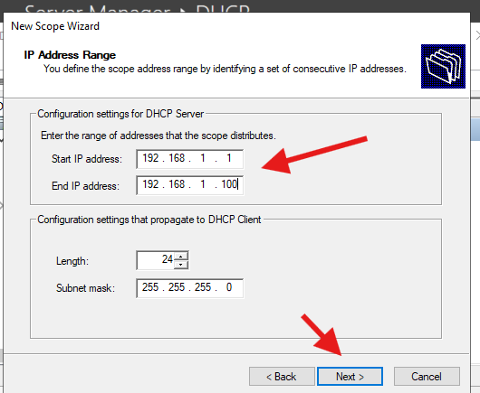

**Figure shows IP address range**

The next step was the exclusion list. This list will consist of IP addresses that will not be assigned to clients by the DHCP server. `192.168.1.1 - 192.168.1.20`

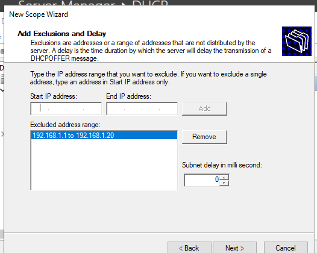

**Figure shows the exclusion list**

Finally, after completing the DHCP set-up wizard, a new scope was created successfully.

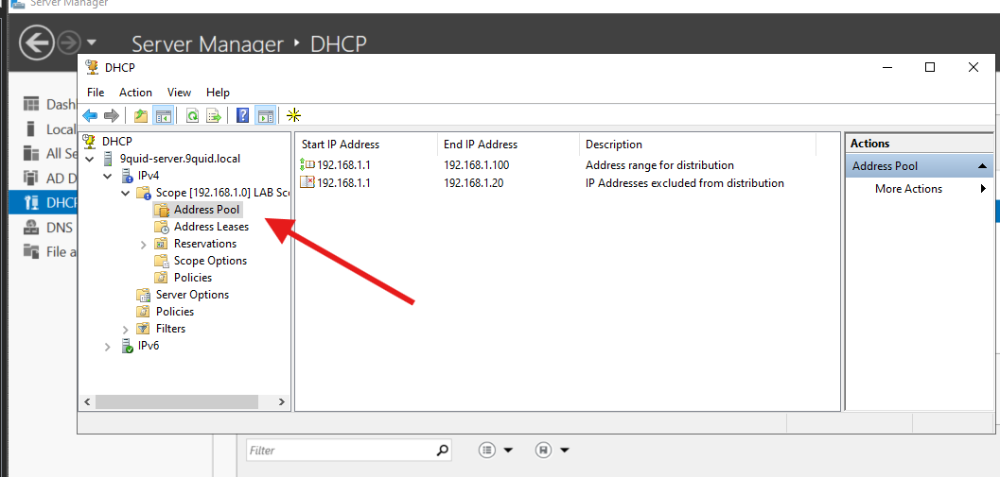

**Figure shows new scope**

> `Note`: At this point I took a snapshot of my Windows server.

### Step 3 Client Testing

I  verified that the Windows 11 client successfully joined the domain.

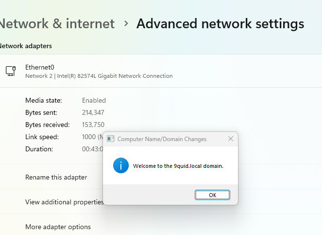

**Figure shows client was joined to domain successfully**

Next I confirmed the client received a DHCP-assigned IP from the server (ipconfig /all).

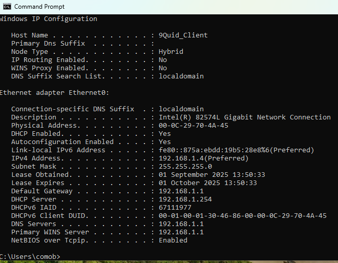

**Figure shows Windows client initial network config.**

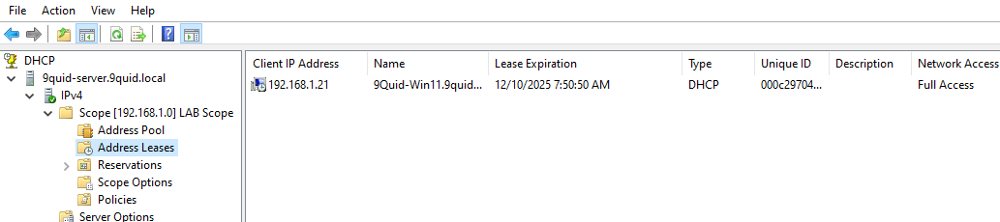

**The image above shows the newly assigned IP to the client by the Dhcp server.**

I made sure the name resolution worked using `nslookup 9quid.local`.

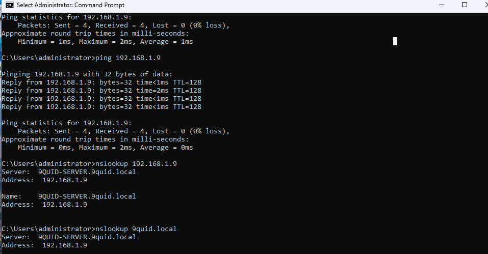

**Figure shows nslookup command was successfull.**

##  Notes

### Key settings

**DNS**: `Forward Zone - 9quid.local;` `Reverse Zone - 192.168.1.0 ;` `port UDP 53`

**DHCP**: `Scope 192.168.1.21–192.168.1.100`; `Exclusions 192.168.1.1–192.168.1.20;`` lease default 8 days;` `ports UDP 67/68

**Server**: `Static IP 192.168.1.9;` `Subnet 255.255.255.0;` `Gateway 192.168.1.1`

### Commands

| Command | Purpose |
|---------|---------|
| `Get-DnsServerZone` | **List DNS zones** |
| `Get-DhcpServerv4Scope` | **List DHCP scopes** |
| `nslookup 9quid.local` | **Test DNS resolution**|
| `ipconfig /all` | **Check client IP** |
| `Restart-Service DHCPServer` | **Restart DHCP service** |
| `ipconfig /flushdns` | **Flush DNS cache** |
| `ipconfig /release` | **Release the client’s current IP address** |
| `ipconfig /renew` | **Get a new IP from the DHCP server** |

>## Active Directory Lab Networking Troubleshooting

This guide documents the networking issues I faced while setting up an `Active Directory (AD) lab` in VMware, how I troubleshooted them, and the final working solution.  

## The Initial Problem

I set up:

- A `Domain Controller (DC)` running AD DS, DNS, and DHCP.

- A `Windows client machine` joined to the domain.

At first:

- Both DC and client used a `NAT adapter`.

- The client got an IP from VMware’s NAT DHCP.

- I installed `DHCP on the DC` and disabled VMware’s DHCP.

This worked for a short while, but then the setup broke. To separate domain traffic from internet access, I added a `Host-Only adapter`.

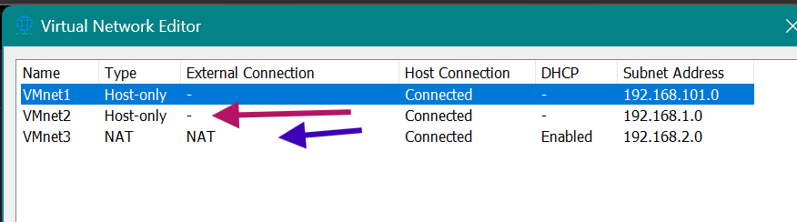

**image shows a second network adapter**

## Issues I Faced

1. **Wrong IP Replies**  
   - The client could get an IP from the DC (good).  
   - But when pinging the DC by name, replies came from the DC’s `NAT IP` instead of the Host-Only IP.  

2. **One-Way Ping**  
   - The client could ping the DC.  
   - But the DC could not ping the client.  

3. **DNS Resolution Fails on Client**  
   - `nslookup` worked fine on the DC.  
   - On the client, name resolution failed or returned the NAT IP.

## How I Fixed It

### 1. Separate Roles for NICs

- **Host-Only adapter** -> for AD, DNS, and DHCP.  
  - Static IP on the DC `192.168.1.9`.  
  - Clients get IPs from this subnet.  
- **NAT adapter** -> only for internet access.  

### 2. Stop NAT NIC from Registering in DNS

On the DC’s NAT NIC:

- Unchecked `Register this connection’s addresses in DNS`. 
- Deleted the NAT IP record from `DNS Manager`.  
- Configured DNS to `listen only on the Host-Only IP`.  

### 3. Configure DHCP Correctly

On the DC’s DHCP scope:

- Option **006 (DNS Server)** = `Host-Only IP of DC`.

- Option **015 (DNS Domain Name)** = `domain name`.

### 4. Refresh Clients

On the client, ran:

- cmd
- ipconfig /release
- ipconfig /flushdns
- ipconfig /renew

### 5 Adjust Network Metrics

To fix DNS resolution issues on the client, I manually adjusted the **network interface metrics**:

- **Host-Only adapter** -> set metric to a `lower value` `5`.  

- **NAT adapter** -> set metric to a `higher value` `50`.  

This setting tells Windows:

- Always use the `Host-Only NIC first` for DNS and AD traffic.  

- Only use the `NAT NIC` when accessing the internet.  

 After making this change, `nslookup` on the client started working correctly.

### Lesson Learned

- Carefully configure DNS and DHCP to avoid connectivity issues.

- Use Forward/Reverse Lookup Zones and DHCP exclusions to prevent conflicts.

- Always document steps and take VM snapshots before major changes.
