# User Access Management

## Introduction

In this lab, I focused on User Access Management in Active Directory. I created Organizational Units (OUs) to structure resources, added users and groups, and configured home folders for centralized data storage. Additionally, I implemented Group Policy Objects (GPOs) to enforce security settings like password policies and logon banners.

- `User`: An individual account in Active Directory that can log in and access resources.

- `Group`: A collection of users used to simplify permission management.

- `Organizational Unit (OU)`: A container in Active Directory for organizing users, groups, and computers, often used for delegation.

- `RDP (Remote Desktop Protocol)`: A protocol that allows users to remotely access and control a Windows machine.

## Objectives

The goal of this lab was to practice user and group management in Active Directory, create and organize OUs, configure home folders, and apply Group Policy Objects (GPOs) to enforce domain-wide policies.

### OUs, Users, and Groups

**Step 1 Creating and Managing Users**

Here, I created a few users, setup their passwords and applied security settings such as; `users must change passwords at next log on`, `disabling accounts`, `unlocking accounts` and `protecting user accounts from accidental deletion`.

Users can be created in several places; from the **Active Directory Administration Center**, from the **Windows Server- Dashboard** in tools, then selecting **Active Directory users and computers** and also through `PowerShell Scripts`.

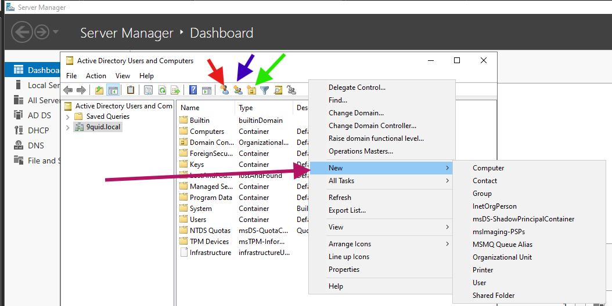

***The above figure shows how to create users and other resources in AD using the Windows Server- Dashboard***

***The figure above shows how to create a user from Active Directory Administration Center***

**Step 2: Creating and Adding Users to Groups.**

Groups can be created in a similar way as creating Users from  Active Directory Admin Center, AD Users and Computers and Powershell.

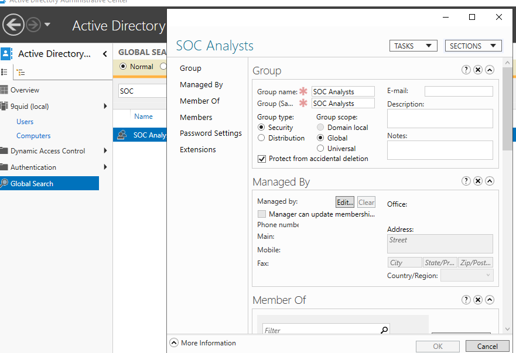

***The figure above shows groups can be created from Active Directory Admin Center**

Next, I created a group called `SOC Analysts` and added the user `Como Brest` to the group.

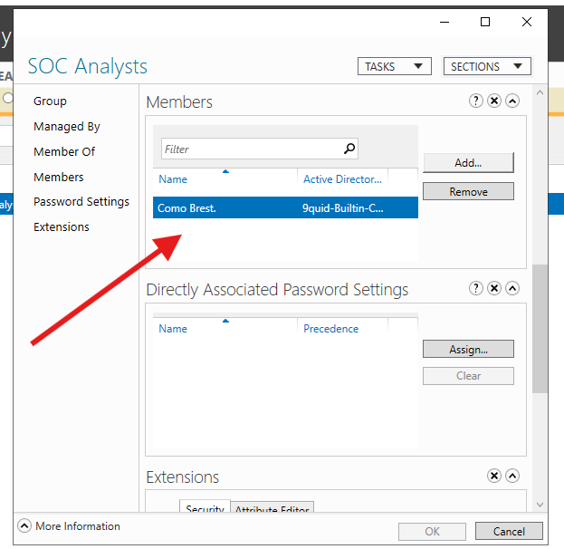

***The figure above shows a member of SOC Analysts group.**

## Creating and managing AD User Home Folders

One way to manage user accounts effectively in a Windows network environment is by creating individual home folders for each user. The procedure is as follows:

**1. Prepare storage for home folders**

I added and initialized an additional hard drive `HomeDirs (E:)`.

Configured appropriate permissions for the intended users.

***The figure above shows an `E`:drive for users***

Next, I created a main folder `Home_Folder` to store all user directories.
   
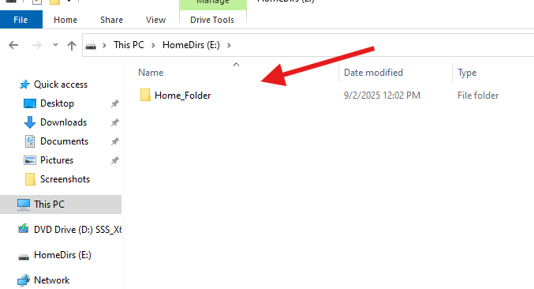

***The figure above shows user's home folder***

**2. Create Active Directory users**

Next I created users: `cbrest`, `labella`, `obbob`, `pfoden`.

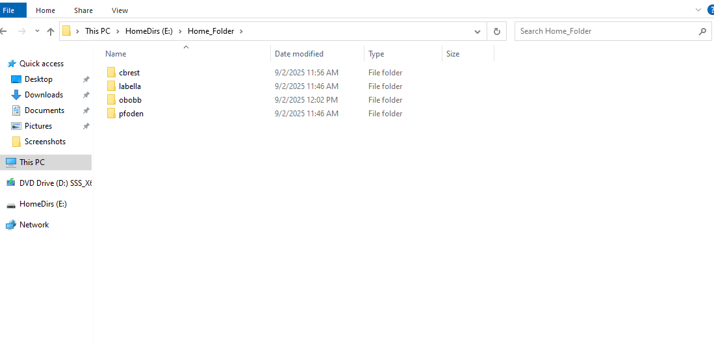

***This figure above shows users created***

**3. Assign home folders to users**

I opened each user’s properties in AD.

In the Profile tab, selected `E:` as the home drive and entered the network path of the user’s folder `(\\ServerName\Homedir\obbob)` and applied the changes.

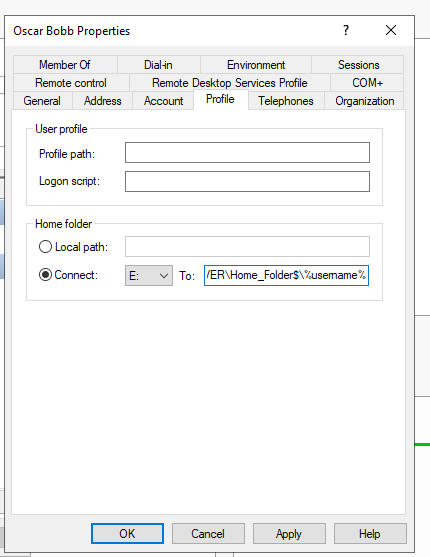

***The figure above shows the folder path for obobb***

**4. Verify user access**

I logged in as obbob on a Windows 11 client.

I confirmed access to the assigned home folder.

lastly, I verified other users could not access folders not assigned to them.

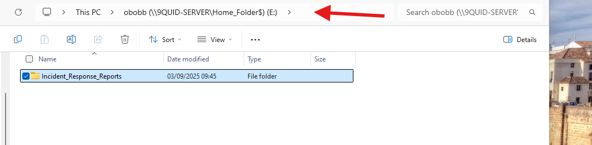

***The figure above shows a folder created by obobb in their home folder***

## Creating and Organizing OUs

Moving forward I explored creating and organizing Organizational Units. Organizational Unit allow us to manage a subset of AD objects where policy can be applied to granularly define groups.

***The figure above shows two Organizational Units***

I explored further and created two OUs in the `Douala- CMR Office branch` namely `IT DEPT` and `SOC DEPT`.

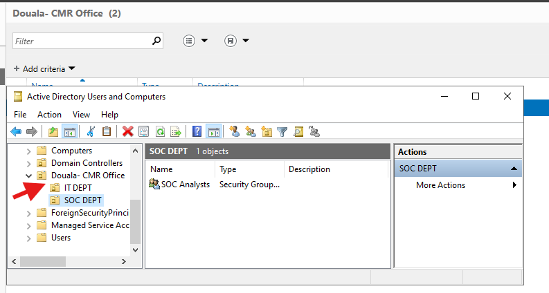

***The figure above shows expanded OU for Douala- CMR Office.***

> `Delegation Note`: OUs are not only used for organizing resources and applying policies, but also for delegating administrative tasks. For instance, the SOC Analysts group could be granted permission to reset passwords or manage accounts within the SOC DEPT OU, without giving them full control over the entire domain.

## Group Policy

Here, I explored how Group Policy Objects (GPOs) can be applied in Active Directory to improve security and enforce organizational standards.
Specifically, I configured:

- An `Interactive Logon Banner` to display a security notice before login.

- `Password Policy Enforcement` to strengthen account security by requiring complex, longer passwords and enforcing lockout rules after failed login attempts.

- `Access to Control Panel & PC Settings` via GPO.

Group Policies refer to how administrators manage users and computers in Active Directory and they do this through `Group Policy Objects` which are the specific rules set by administrators to manage users and computers behaviour in Active Directory like logon banners, password requirements, software installations.

### Lab 1: Configuring a Logon Banner**

I opened Group Policy Management.

Next, I created a new GPO called Logon Banner and linked it to the Domain.

I then navigated to: `Computer Configuration` -> `Windows Settings` -> `Security Settings` -> `Local Policies` -> `Security Options`.

Configured Interactive logon: Message title for users attempting to log on -> `Property of 9Quid Security`.

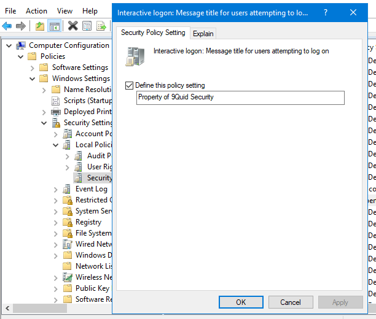

***The figure above shows the interactive logon message setting.***

`Interactive logon`: Message text for users attempting to log on ->  ***This computer System is the property of 9Quid Security. Access is restricted to authorized personnel for official buisness purposes. Unauthorized use or access is srtictly prohibited and may result in disciplinary action and/or prosecution. Users should have no expectations of privacy.***

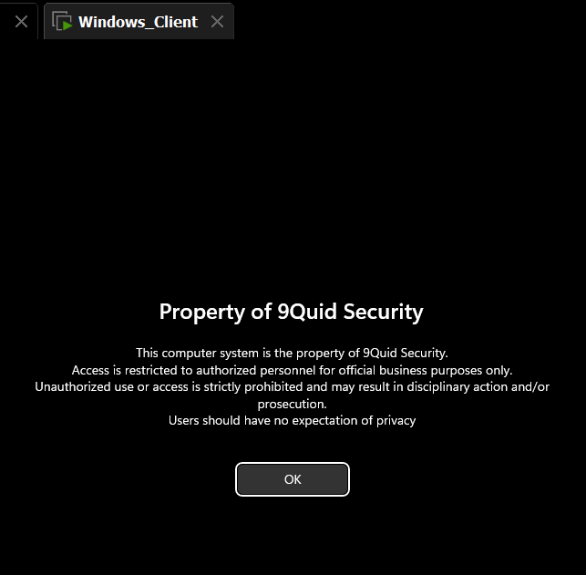

***The figure above shows the logon banner displayed prior to authentication.***

### Lab 2: Password and Account Lockout Policy Enforcement**

`Step 1: Open Group Policy Management`

On the Domain Controller, I opened `Group Policy Management` from `Server Manager` then `Tools`.

`Step 2: Edit Default Domain Policy`

I expended the domain  `9quid.local`.  

Right-clicked `Default Domain Policy` and selected `Edit`.

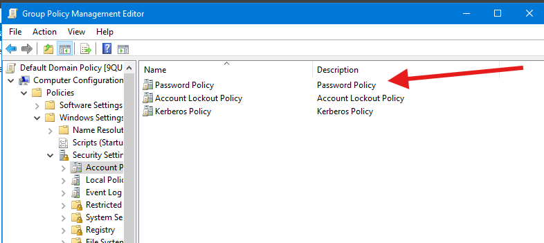

***The figure above shows Navigating to Password Policy in GPO.***

`Step 3: Configure Password Policy`

Next, I navigated to: `Computer Configuration` -> `Policies` -> `Windows Settings` -> `Security Settings` -> `Account Policies` -> `Password Policy`.

- `Enforce password history` -> **24 passwords remembered**

- `Maximum password age` ->  **60 days**  

- `Minimum password age` -> **1 day**  

- `Minimum password length`-> **12 characters**  

- `Password must meet complexity requirements` -> **Enabled**

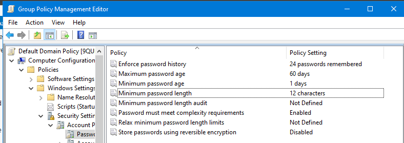

***The figure above shows the policy Configurations of minimum length and complexity settings***

`Step 4: Configure Account Lockout Policy`

Next I navigated to: `Computer Configuration` -> `Policies` -> `Windows Settings` -> `Security Settings` -> `Account Policies` -> `Account Lockout Policy`.

- `Account lockout threshold` -> **3 invalid attempts**  
- `Account lockout duration` -> **15 minutes**  
- `Reset account lockout counter after` -> **15 minutes**

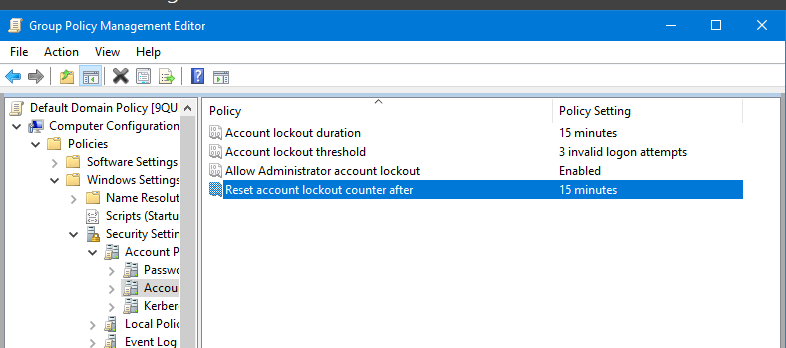

***The figure above shows Account lockout policy configuration.***

`Step 5: Apply & Test`

I entered a password that did not meet the password requirement for the user `cbrest` to test whether the domain’s password  policy was enforced correctly.

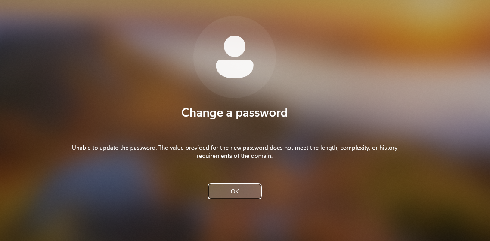

***The figure show a client test showing weak password rejection.***

I also entered three incorrect passwords to confirm that the account lockout policy was triggered.
  
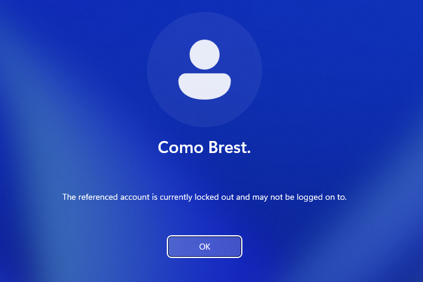

***The figure shows Client test showing account lockout after failed attempts.***

`Lab 4: Restricting Access to Control Panel & PC Settings via GPO`

The objective of this lab was to prevent regular domain users from accessing the Control Panel and PC Settings, ensuring that only administrators can make system configuration changes.

`Step 1: Create a New GPO`

I navigated to Group Policy Management.

Next I right-clicked  `9quid.local`.

Then I selected create a GPO in this domain, and Link it here and named it `Restrict Control Panel Access`.

`Step 2: Configure the GPO`

From here, I right-clicked on the `GPO` -> `Edit`.

Next, I navigated to `User Configuration` -> `Policies` -> `Administrative Templates` -> `Control Panel`.

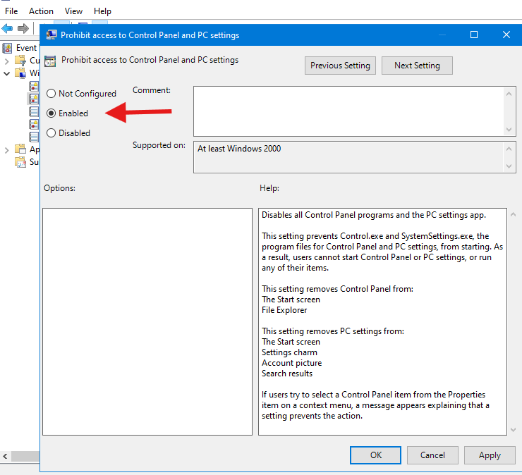

***The figure shows the policy setting window with Enabled selected.***

`Step 3: Apply the Policy and Verify the Result`

- On the client machine I ran the following command `gpupdate /force`

- I attempted to open the Control Panel and PC Settings.

- Access was blocked, and an error message confirmed the policy was applied
successfully.

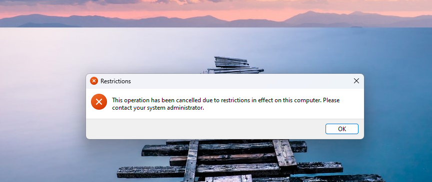

***The figure above shows access has been restricted to control panel for regular domain users***

### Common Commands

- Force Group Policy Update: `gpupdate /force`

- Check Which GPOs Are Applied to a User/Computer: `gpresult /r`

- Check Domain Info & FQDN: `echo %USERDOMAIN%`, `echo %COMPUTERNAME%`, `systeminfo | findstr /B /C:"Domain"`

### Settings

- Key Group Policy Settings Used:

**Interactive Logon Banner:**
`Computer Configuration → Windows Settings → Security Settings → Local Policies → Security Options`

**Password & Account Lockout Policy:**
`Computer Configuration → Policies → Windows Settings → Security Settings → Account Policies`

**Restrict Control Panel Access:**
`User Configuration → Policies → Administrative Templates → Control Panel → Prohibit access to Control Panel and PC Settings`

### Lessons Learned

- Users, groups, and OUs help organize and secure Active Directory.

- Home folders simplify backups and data management. Storing user data on a central server makes it easier to back up and ensures data is retained if a user's workstation fails.

- GPOs are powerful. They can enforce a wide range of settings from a central location.

- Password and lockout policies protect against weak credentials and brute-force attempts.

- Testing with gpupdate and gpresult is key to confirming policies are applied.

- If the accidental deletion box is checked then groups or objects can not be moved.
  
- These skills are directly applicable to helpdesk work, since junior IT staff often handle user account creation, unlocking, and GPO enforcement.

- From a cybersecurity perspective, enforcing password/lockout policies helps reduce risks like brute-force attacks and weak credentials.
