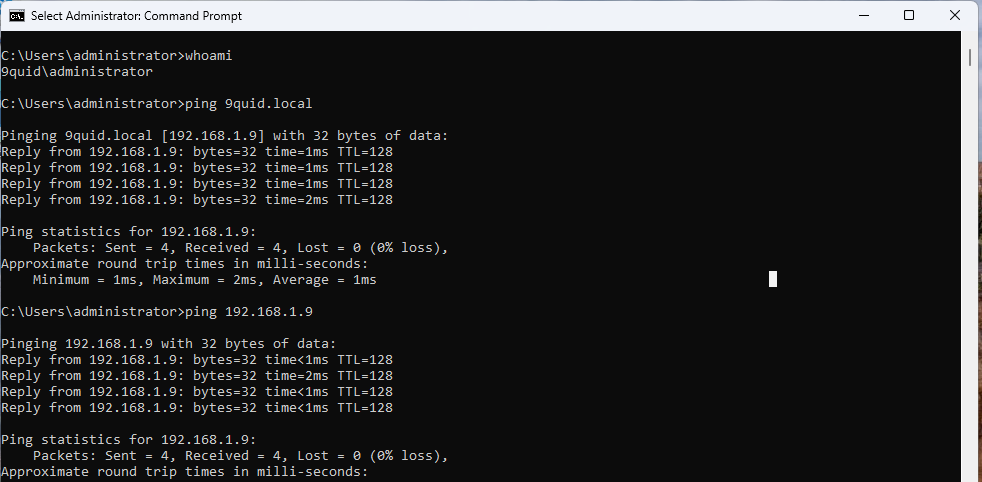
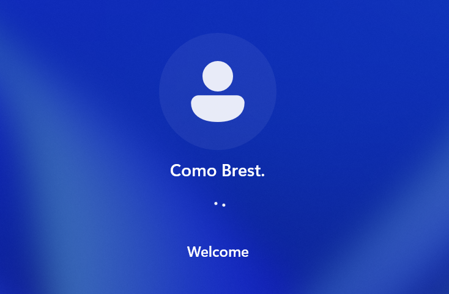
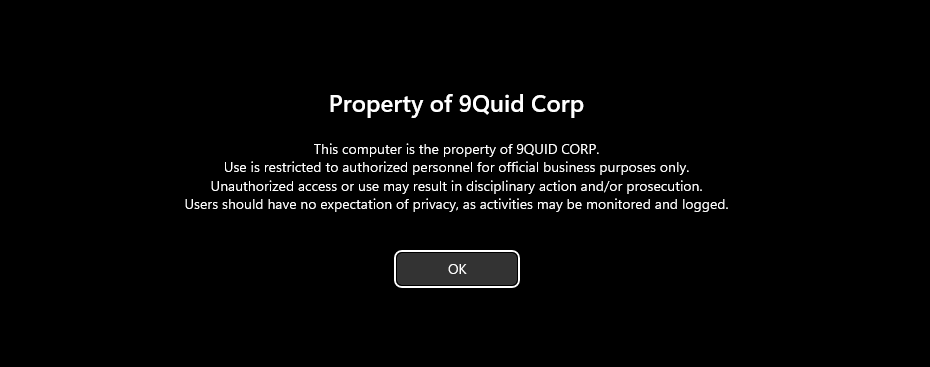

# Joining a Windows Client to the Domain

## Introduction

In this lab, I installed a Windows 11 client, configured its network settings, and joined it to the Active Directory domain. I then verified that domain user accounts could log in and that Group Policies were applied correctly.

**Domain Join:** The process of connecting a computer to an Active Directory domain so it becomes part of a centrally managed network.

## Objective

The goal of this lab was to join a Windows client machine to the Active Directory domain, verify that domain user accounts could log in, and confirm that Group Policies were applied successfully

### Step 1: Install Windows 11

Installed Windows 11 Pro on VMware with `4 GB RAM`, `2 CPUs`, and `64 GB disk`.

**The image shows the set-up in vmware**

Next, I selected `Windows 11 Pro for workstation`.

**The image shows the win11 version**

I then completed the installation setup and confirmed the client booted successfully.

**Image shows win11 successully installed**

### Step 2: Configure Network Settings

- I configured DNS to point to `192.168.1.9`.

**image shows dns settings**

- I verified connectivity using ping `192.168.1.9` and ping `9quid.local`.

**image shows successfull communication with DC**

### Step 3: Join Client to the Domain

- I opened System Properties → Changed Computer Name/Domain to `9Quid-11` → selected Domain.

**image shows successfull name change**

- I entered `9quid.local` and authenticated with the Domain Admin account.

**image shows win11 has been joined successfully**

- I restarted the machine to complete the domain join.

### Step 4: Verify Domain Login

- At login screen, I selected Other user and signed in with domain account `9quid\cbrest`.

- I confirmed the login was successful and profile created.

**image shows successfull log in**

### Step 5: Test Group Policy Application

- I ran `gpupdate /force` to refresh policies.

- I then confirmed that `Control Panel restrictions` and `logon banner` appeared as configured in previous chapters.

**Image shows group policy was applied successfully**

## Notes

### Key Settings

- Configured the client to use the Domain Controller’s Host-Only IP as its DNS server.

- Verified network connectivity by pinging the Domain Controller.

- Joined the client machine to the domain via System Properties.

- Rebooted the client and logged in with a domain user account.

### Troubleshooting

- If domain join failed, checked DNS settings, client must use DC’s DNS, not external DNS.

- Verified that the DC and client were on the same Host-Only network.

- Used nltest /dsgetdc:yourdomain.local to confirm the client could locate the Domain Controller.

- Ensured correct time synchronization between client and DC (Kerberos requires this).

### Lessons Learned

- Domain joins depend on DNS resolution; if DNS isn’t correct, it will fail to join.

- Always confirm the client is getting its IP and DNS from the DHCP scope on the DC.

- After a successful join, domain policies like `control panel restrictions from Chapter 4` apply immediately after `gpupdate /force` or a `reboot`.
