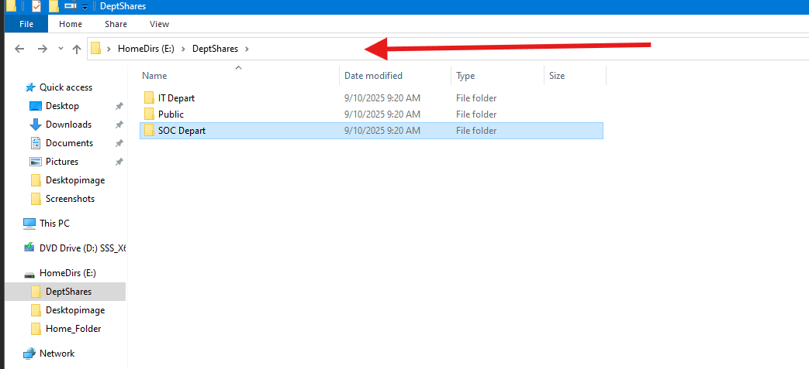
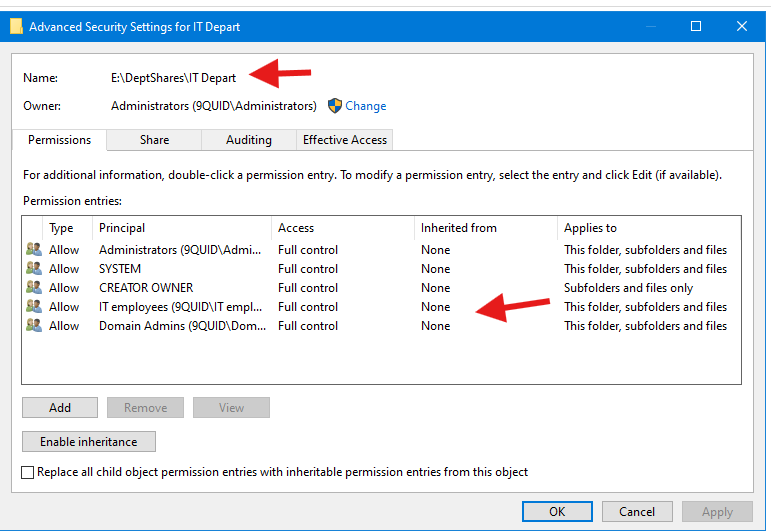
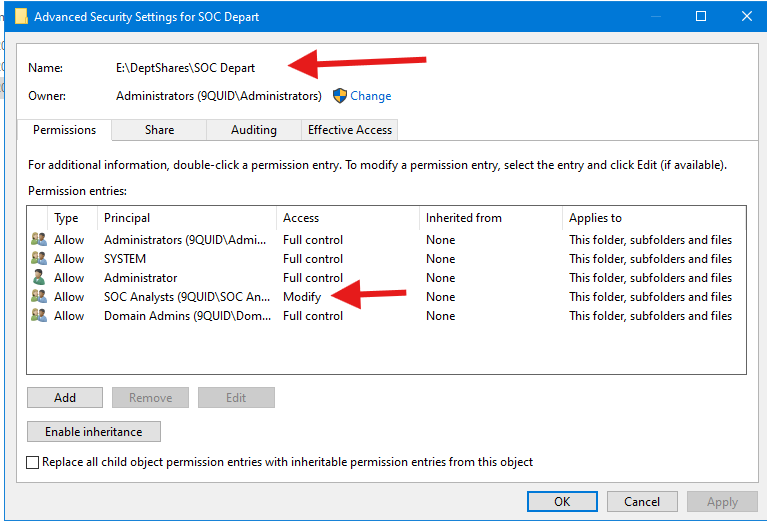
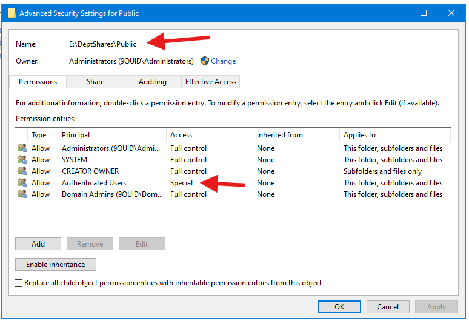
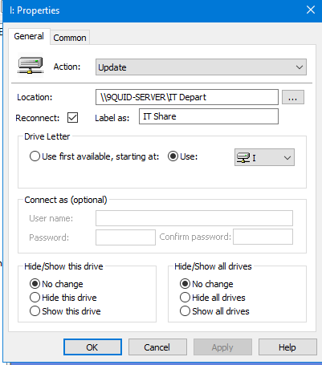
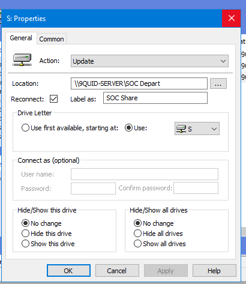
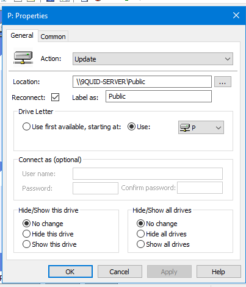
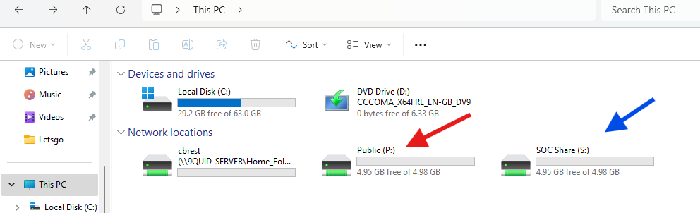

# File Access Management (NTFS, Shares, and Drive Mapping)

## Introduction

In this lab, I learned how to manage file access in a Windows Server 2022 Active Directory environment. Specifically, I looked at NTFS permissions, share permissions, and drive mapping using Group Policy.The aim was to create a secure, role-based file sharing system where users only see and access resources they are authorized for.

- `NTFS Permissions`: Control access at the file system level (applied on the disk itself).

- `Share Permissions`: Control access at the network share level.

- `Effective Access`: The most restrictive combination of NTFS and Share permissions.

- `Drive Mapping`: Assigns a drive letter on client machines for easier access to network resources.

## Objectives

The aim of this lab was to create shared folders for departments and users, apply NTFS and Share permissions following least privilege principles and automate drive mapping using Group Policy.Finanlly, test access with different Active Directory user accounts.

### Creating and Securing Shared Folders

## Step 1: Prepare Department Share Folders

On the `E`: drive (already used for `Home_Folder`), I created a new root folder: `DeptShares` with subfolders `IT Depart`, `Public`, `SOC Depart`.

***The figure above shows the subfolders for the DepartShares folder***

## Step 2: Configure NTFS Permissions

I assigned permissions based on the principle of least privilege.

- IT Folder `(E:\DeptShares\IT):`

  - IT Department Group -> `Full Control`

  - Domain Admins -> `Full Control`

***The figure above shows the advanced permissions for the IT Depart Folder***

- SOC Folder `(E:\DeptShares\SOC):`

  - SOC Analysts Group -> `Modify`

  - Domain Admins -> `Full Control`

***The figure above shows advanced permission settings for the SOC Depart Folder***

- Public Folder `(E:\DeptShares\Public):`

  - Authenticated Users -> `Read/Write`

  - Domain Admins -> `Full Control`

***The figure above shows advanced permission settings for the Public Folder***

  - **Note on Permissions:**: When setting NTFS permissions, I first removed all existing permissions then explicitly added only the groups that required access. I configured both Share Permissions (set to `Authenticated Users - Full Control`) and NTFS Permissions (set specifically for each group). The most restrictive of these two permission sets is what applies. This is a standard best practice to manage access at the more granular NTFS level.

**Step 3: Configure Share Permissions**

Next, I shared each folder with the following settings:

Share Name matched the folder name such as `IT`, `SOC`, `Public`.

Share Permissions:

`Everyone` -> `Full Control` as this simplifies management.

   -  Best practice is to rely on NTFS permissions for security. Share permissions are left open (Full Control for Everyone) so NTFS governs effective access.

**Step 4: Group Policy Drive Mapping**

Moving on to this section, I configured automatic drive mappings via Group Policy to simply user access.

- First, I opened `Group Policy Management`.

- Next I created a new GPO: `DeptShare Mapping`.

- Then linked it to the `Douala- CMR Offic` OU.

- I navigated to: `User Configuration -> Preferences -> Windows Settings -> Drive Maps`

- Next I added drive mappings:

`1: IT Share`

**The figure shows the IT share drive config**

`2: SOC Share`

***The figure above shows the SOC drive config***

`3: Public Share`

***The figure above shows the public share drive config***

**Step 5: Test Access**

I then logged into my Windows 11 client as SOC Analyst `(cbrest)`.

Verified that:

`S:` mapped automatically to `\\9QUID-SERVER\SOC Depart`.

`P:` mapped automatically to `\\9QUID-SERVER\Public`.

`I:` was not mapped (since the user wasn’t in IT).

Next, I tested access rights:

- SOC user could create/edit files in SOC but not in IT.

- SOC user could access Public with read/write.

- IT-only users confirmed restricted access to SOC.

***The figure above shows Windows 11 client automatically mapped drives***.

## Share vs NTFS Permissions

| **Share Permission** | **NTFS Permission** | **Effective Result** |
|-----------------------|----------------------|-----------------------|
| Read                 | Read                 | User can only view files/folders. No create/modify/delete. |
| Read                 | Write                | User can create new files/folders, but cannot edit or delete existing ones. |
| Read                 | Modify               | User can view and edit files, create new ones, and delete. |
| Read                 | Full Control         | User can do everything except share-level changes. NTFS still controls. |
| Change (Read/Write)  | Read                 | User can browse but **cannot create or modify** (NTFS restricts). |
| Change (Read/Write)  | Write                | User can create files/folders, but **cannot modify/delete existing ones**. |
| Change (Read/Write)  | Modify               | User has typical **read/write access** (create, edit, delete). |
| Change (Read/Write)  | Full Control         | User can do everything, including modifying permissions. |
| Full Control         | Read                 | User restricted to Read (NTFS overrides share). |
| Full Control         | Write                | User can create but not edit existing files. |
| Full Control         | Modify               | User can create, edit, delete files/folders. |
| Full Control         | Full Control         | User has complete control over files, folders, and permissions. |

> **Note**: At this point I took a snapshot of my Server and Win11 client.

## Difficulties Encountered

One of the difficulties I faced was drive mappings not applying in the beginning. This was due to:

- Linking GPO to wrong OU.

- Users not being in the correct OU.

- Security filtering only having Authenticated Users.

## Troubleshooting Steps

**Check GPO Scope & Link**

- Confirm the GPO is linked to the right OU.

- Run `gpresult /r` on the client to confirm GPO application.

**Verify Security Filtering**

- If a drive doesn’t map, check the `Security Filtering tab.`

- Ensure the target group `(SOC/IT)` is listed.

- Test UNC Paths Directly

- Try `\\ServerName\ShareName` in File Explorer.

- If accessible but drive isn’t mapped -> GPO issue.

- If not accessible -> NTFS/Share permissions issue.

**Check Event Viewer**

- Look under `Applications and Services Logs -> Microsoft -> Windows -> GroupPolicy -> Operational for drive mapping errors.`

**Test Effective Permissions**

- Right-click folder -> Properties -> Security -> Advanced -> Effective Access.

- Test with a one of the  SOC/IT users.

## Lessons Learned

- GPO scope is important as linking a GPO at the OU level applies only to users & computers in that OU while linking at the domain root applies it broadly.

- Security filtering is equally crucial because by default, only `Authenticated Users` are allowed to apply the GPO. For targeted mapping, you must add specific security groups (e.g., SOC Group, IT Group).

- When it comes to Share vs NTFS Permissions `Effective access` is the most restrictive combination of Share + NTFS. Here, it means you will only get the least level of permissions granted by either share permissions or NTFS

- Drive Mapping Preferences: Use `Update` and not `Create` to ensure mappings stay consistent without breaking existing ones.

- Best Practice: Keep shares group-specific at both the Share and NTFS level avoid leaving “Authenticated Users” with permissions.

- The Principle of Least Privilege is key. By denying write access to the `SOC` group for the `IT` share, I ensured that users only have the exact permissions they need, reducing the risk of accidental or malicious data modification.

- GPOs automate drive mapping. This is far more efficient and less error-prone than manually mapping drives on each user's machine. It ensures a consistent user experience and that all users have access to the resources they need upon login.