# Internet Information Services (IIS) and Print Services

## Introduction

IIS stands for Internet Information Services and it is a Microsoft's web server platform in windows server that allows for hosting of websites, web applications and other services like file/web sharing, web apps, internal portals. It also supports `HTTP(80)`, `HTTPS(443)`, `FTP(20/21)`, `SMTP(25)`. It is important because it intergrates with Active Directory for authentication which allows only authorized personnel access to resources.

Print Services in Active directory enables windows server to act as a centralized print server. This allows administrators to manage printers and print tasks more efficiently.

##  Objectives

The objective of this lab is to install and configure IIS for internal website hosting, Secure the IIS website using an SSL/TLS certificate issued by Active Directory Certificate Services (AD CS), set up the Print Services role, share and deploy a printer through Group Policy, and verify access from client machines.

## Part 1: IIS Setup and Configuration

**Step 1: Install IIS Role**

- On the server, I opened `Server Manager` -> `Add Roles and Features`-> `Role-based or feature-based installation.`

- Selected the `local server` and under Server Roles, checked `Web Server (IIS)`.

- Added `required features` -> `click Next` -> `Install`.

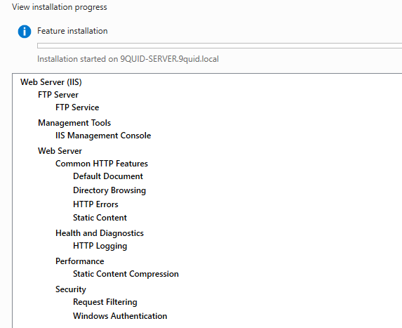

***The figure shows the installation wizard of IIS***

**Step 2: Added a New Host (A record) in DNS**

- On the server, I navigated `Server Manager` -> `Tools`

- Then selected DNS, expanded my server `9quid.local` and in the `Forward lookup Zone` created a new `A New Host (A record)`

 - `Note`: I added a new host record because, in my DNS I did not have a record for `www.9quid.local`

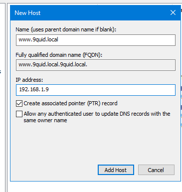

***The figure above show a new host record***

**Step 3: Verify IIS Installation**

- To verify the installation was succesful, I opened a browser on the server and navigated to:`www.9quid.local`

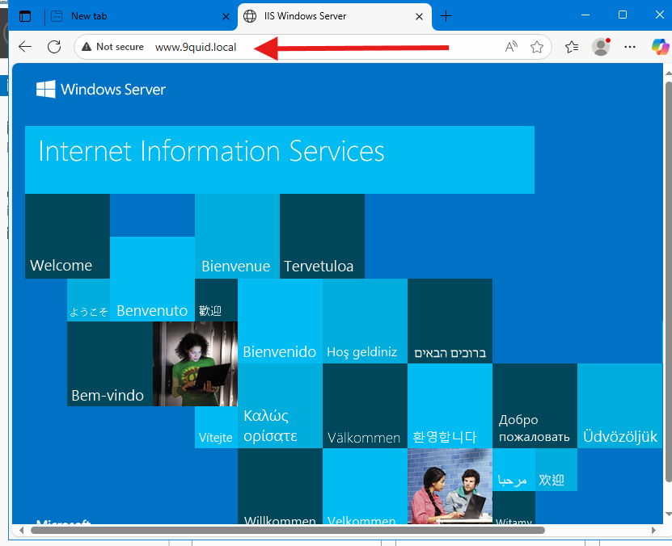

***The figure above shows the default homepage for ISS***

**Step 3: Create and Verify a Test Website**

As I continued to explore further, I created a custom website. The HTML code was generated with the assistance of OpenAI’s ChatGPT.

- I navigateed to: `C:\inetpub\wwwroot`.

- Next, I created a new `index.html` file with the generated code. 

- I opened a browser on the Windows Server and typed `www.9quid.local`

- The custom `index.html` page I created was displayed, confirming that the IIS website is running successfully.

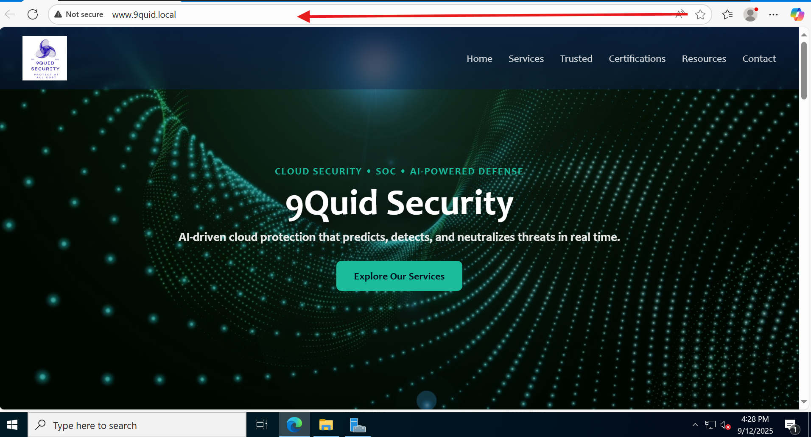

## Securing IIS with a Domain Certificate

To further strengthen the lab, I secured the internal IIS website by installing and configuring `Active Directory Certificate Services (AD CS)`. I then issued a domain-signed SSL/TLS certificate and bound it to the site in IIS, ensuring encrypted communication and centralized trust within the domain environment.

**Step 1: Install AD CS Role**

- On the server, I opened `Server Manager` -> `Add Roles and Features` and selected `Role-based or feature-based installation.`

- Under Server Roles, I checked Active Directory Certificate Services (AD CS) and proceeded with the installation.

- Completed the post-installation wizard to configure the CA as an Enterprise Root CA.

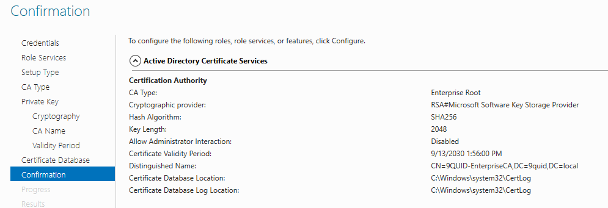

***The igure above shows the AD CS role installation the server.**

**Step 2: Request and Issue a Domain Certificate**

- Within `IIS Manager`, I selected the `server node` and opened `Server Certificates.`

- From the Actions pane, I chose `Create Domain Certificate`.

- Entered the Common Name `www.9quid.local`, Organization `9Quid Security`, and OU `IT`.

- Selected the CA `9quid-CA` I had just configured, and issued the certificate.

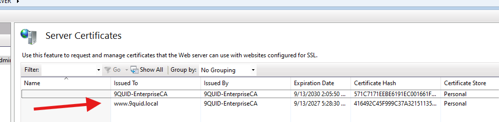

***The figure above shows the domain certificate issued by the internal CA.***

**Step 3: Bind Certificate to IIS Website and Verify Secured Website**

- In `IIS Manager`, I selected my `website` and clicked `Bindings`.

- Edited the `HTTPS binding` and selected the `new domain certificate`and applied changes.

- Opened a browser and navigated to: `https://www.9quid.local`.

- The site now loaded with a padlock icon, indicating the connection was secured with a valid SSL/TLS certificate issued by the domain CA.

I secured the IIS site with an SSL certificate to ecrypt communication between clients and server. This prevents sensitive data, like authentication traffic, from being intercepted or tampered with. It also ensures the site is trusted within the domain because the certificate was issued by our internal Active Directory Certificate Services (AD CS).

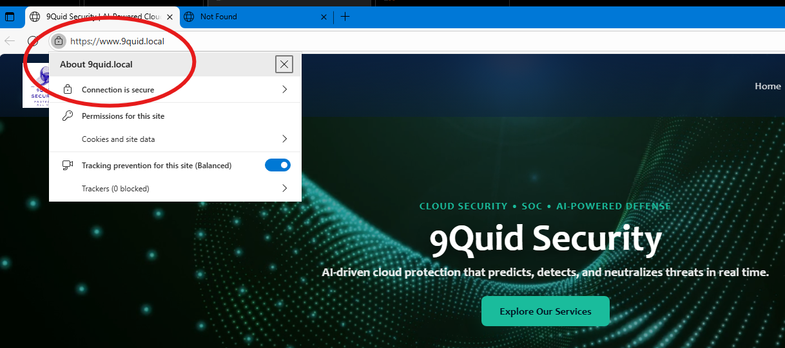

***The figure above confirms a secure communication***

## Part 2: Print Services Setup

**Step 1: Install Print Services Role**

- In `Server Manager` navigated to `Add Roles and Features` then selected `Print and Document Services.`

- `Under Role Services`, chose `Print Server.` and click `Install.`

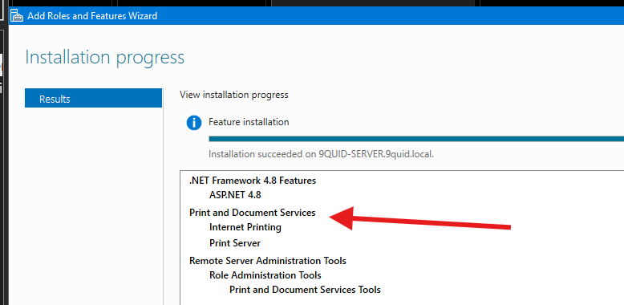

**The figure above shows the installation wizard of print services**

**Step 2: Add a Shared Printer**

- Next, I went to `Print Management`.

- Expanded `Print Servers` -> `9quid.local` -> `Printers`, right-clicked -> `Add Printer` -> `Add a local printer`.

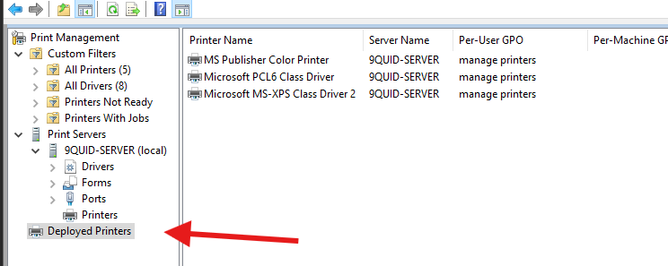

***The figure above shows deployed printers***

- Finally, I tested and verified the printers were added to my win11 machine as seen below:

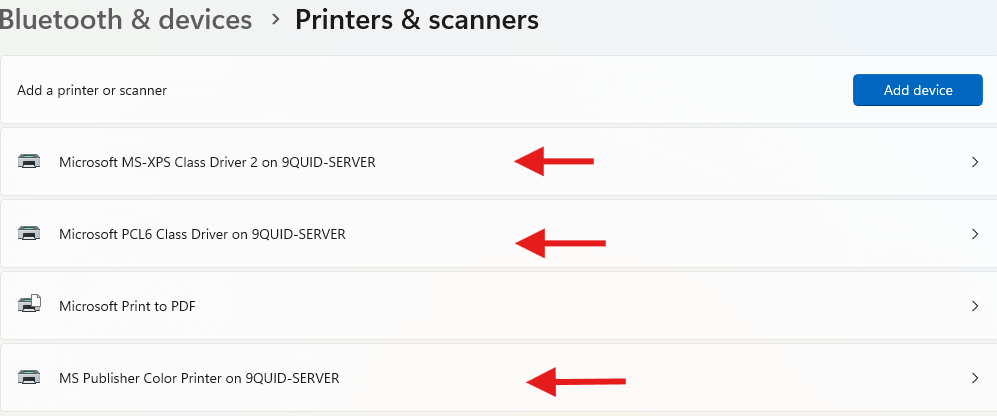

***The figure above confirms the printers were added to the win11***

- To add, I also verified that the printers could be managed via a web browser using the Internet Printing feature, which allows for centralized management and easier access for users.

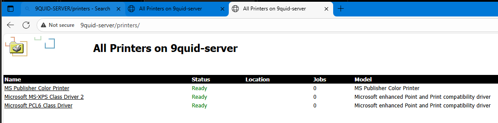

***The figure above confirms the printers on the server***

**Key Settings**

- Installed and configured IIS to host and manage websites.

- Installed Print Services and added virtual printers for centralized management.

- Shared the printer so domain users could access it through the server.

- Verified Web-based printer management via `http://9quid.local/printers/.`

- `SSL Certificate`: Installed AD CS and issued a domain-trusted SSL certificate for `www.9quid.local.`

- `Binding`: Added HTTPS binding in IIS and assigned the certificate to secure the site.

**Difficulties Encountered/ Resolution**

- Site showed ***“Not Secure”*** warning beacause the Initial certificate request (via IIS GUI) did not include Subject Alternative Names (SANs), which modern browsers require.

- To resolve this I created an INF file with SAN entries and generated a request using PowerShell:

`certreq -new C:\CertRequests\iis_san.inf C:\CertRequests\iis_san.req`

- Certificate was not visible in IIS Manager. After issuance, the certificate was not yet in the server’s Personal store.

- Fixed this by Accepting and installing the certificate using powershell:

`certreq -accept C:\CertRequests\iis_san.cer`

- Certificate misconfiguration (Root CA bound instead of Web Cert). Here, IIS was mistakenly bound to the Root CA certificate instead of the issued WebServerSAN certificate.

- Rebound the correct issued certificate (www.9quid.local) under `IIS` -> `Site Bindings` -> `HTTPS`.

- Browser error: ***“This server couldn’t prove its identity… no Subject Alternative Name”***. The Certificate only contained a CN, no SANs.

- Resolved this by submitting the updated SAN-enabled request to the CA and retrieved the issued cert:

`certreq -submit C:\CertRequests\iis_san.req C:\CertRequests\iis_san.cer`

**Troubleshooting**

- Verified IIS service was running when the site didn’t load.

- Checked firewall rules to allow web traffic.

- Ensured printer was shared correctly and users had permissions to connect.

- `Site Not Secure` Error is caused by missing `Subject Alternative Name (SAN)`. Solution: use `certreq` with an `INF file` instead of the GUI to request a SAN-enabled cert.

- If `Certificate Not Showing in IIS`, after issuance, the cert must be accepted (certreq -accept) so it moves into the Personal store.

**Lessons Learned**

- Centralizing web services and printers through the server simplifies administration.

- Permissions and firewall rules are often the first checks when services fail.

- Even virtual printers help practice real-world scenarios of deploying and managing shared resources in Active Directory.

- Enabling `HTTPS` demonstrates encryption and trust inside Active Directory environments.