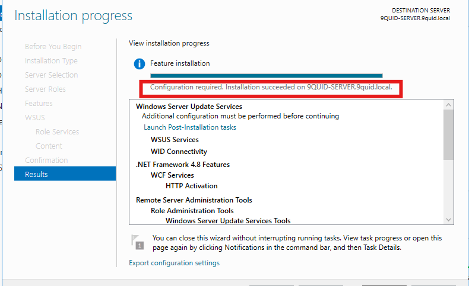
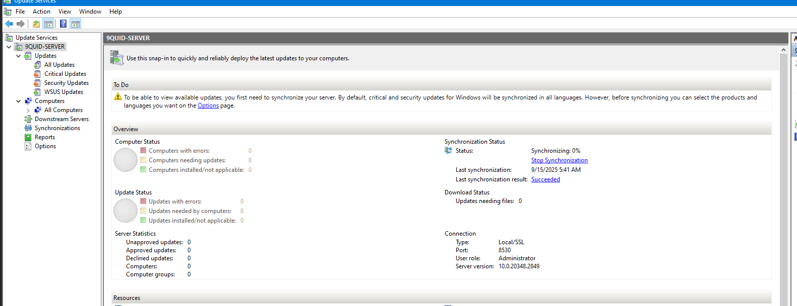
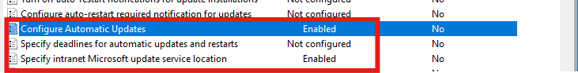
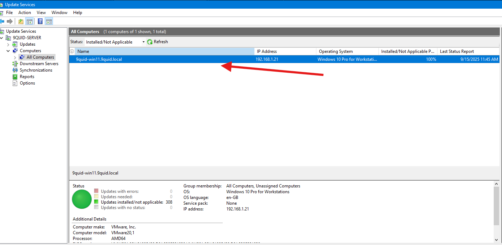

# 8. Windows Server Update Services (WSUS)

## Introduction

In this lab, I focused on setting up `Windows Server Update Services (WSUS)` to centrally manage and deploy updates across my Active Directory environment. Instead of each client downloading updates directly from the internet, WSUS allows updates to be downloaded once and then distributed internally which saves bandwidth and gives administrators more control.

## Objectives

The objectives of this lab was to install and configure the WSUS role on Windows Server 2022 and synchronize updates from Microsoft Update. Create computer groups for targeted update deployments, approve and deploy updates to domain-joined clients. Lastly verify that clients received and applied updates from the WSUS server.

**Steps 1. Prepare Storage for WSUS**

- First, I added a dedicated `20GB` virtual hard drive to be used for the WSUS server.

- In Disk Management, I initialized the new disk, created a volume, and formated it with NTFS.

- Lastly, I assigned it a drive letter `W:\WSUS`. This new drive will be used as the WSUS Content directory.

**Step 2. Install the WSUS Role**

- On `Server Manager`, I navigated to `Add Roles and Features` and selected `Windows Server Update Services`.

- Next, I selected `WSUS Services` and `WID Database` and pointed it to the new drive when prompted for the content directory `W:\WSUS`.

- I then completed the installation and launch the WSUS Configuration Wizard.

***The figure above shows the installation succeeded***

**Step 3. Configure WSUS**

- Here, in the configuration wizard, I chose to synchronize updates from Microsoft Update.

- Next, I selected the products to update `Windows 11`, `Windows Defender for endpoint`, `Windows Antivirus`.

- Under **Classifications**, I selected `Security Updates`,`Critical Updates` `Definintion updates` and set sync schedule to `manual` .

- Then finished the wizard and allowed WSUS to download metadata.

***The figure above shows WSUS config***

**Step 3. Approve and Manage Updates**

- Next, I opened the WSUS Console, reviewed new updates after synchronization and approved updates for deployment.

- Created a Computer Group called `Windows client` for staged rollouts.

**Step 4. Configure Group Policy**

- In `Group Policy Management`I createed a new GPO and linked it to the domain.

- Navigated to `Computer Configuration` -> `Administrative Templates` -> `Windows Components` -> `Windows Update`

- Next, I configured `Specify intranet Microsoft update service location` and `Automatic Updates`.

***The figure above shows the two gpo policy configured**

**5. Verify Client Connectivity**

- To verify that the policy worked, I logged into my domain joined client machine and ran the following commands:

`gpupdate /force` -> `usoclient startscan`

***The figure above shows Win 11 successfully connected***

## Key Settings, Troubleshooting, Lessons Learned

**Key Settings**

- WSUS default ports: 8530 (HTTP), 8531 (HTTPS).

- Group Policy ensures clients look to WSUS, not Microsoft Update.

- Use Computer Groups to stage updates safely before production.

**Troubleshooting**

If clients don’t report:

- Check DNS resolution of the WSUS server.

- Ensure firewall ports 8530/8531 are open.

- Confirm Windows Update service is running: `Get-Service -Name wuauserv`

- Verify GPO application with: `gpresult /r`

**Lessons Learned**

- WSUS saves bandwidth by downloading updates once and distributing internally.

- Staged rollouts minimize risks of faulty updates.

- Always approve updates for Test group first before deploying to Production.
 
 #NOTES
 
# WSUS Client Troubleshooting Checklist

| Step | Command | Purpose | Expected Result / Notes |
|------|---------|---------|------------------------|
| 1 | `Get-Service -Name wuauserv` | Verify that Windows Update service is running | Status should be **Running** |
| 2 | `Start-Service -Name wuauserv; Set-Service -Name wuauserv -StartupType Automatic` | Start Windows Update service and set it to start automatically | Service becomes **Running** |
| 3 | `Get-Service -Name bits` | Verify that Background Intelligent Transfer Service is running | Status should be **Running** |
| 4 | `Start-Service -Name bits; Set-Service -Name bits -StartupType Automatic` | Start BITS and set it to start automatically | Service becomes **Running** |
| 5 | `Test-NetConnection -ComputerName 192.168.1.9 -Port 8530` | Check TCP connection to WSUS server | `TcpTestSucceeded: True` indicates connectivity is OK |
| 6 | `usoclient startscan` | Force client to immediately check for updates | Runs silently; updates should appear in WSUS shortly |
| 7 | `wuauclt /resetauthorization /detectnow` | Force client to re-register and check for updates (legacy method) | Client re-authorizes and scans WSUS |
| 8 | - | Verify in WSUS console under **All Computers** | Last Contact Time updates; client appears in WSUS |

