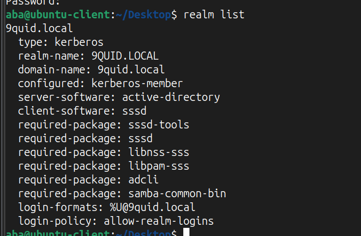

# Introduction

In this lab, I integrated an Ubuntu Desktop client into the `9quid.local` Active Directory domain. This process allows for centralized authentication, enabling Linux users to log in with their AD credentials. This is crucial in mixed-OS environments for maintaining a single source of truth for user identities and simplifying access management.

### Objectives

The objective of this lab was to configure the Ubuntu client’s networking to enable communication with the Active Directory domain, install and configure the necessary packages for domain integration, and successfully join the Ubuntu machine to the AD domain. Additionally, the lab aimed to test centralized authentication using AD user accounts and to access and validate Windows file shares from the Linux client.

### Core Components for Integration

This integration relies on several key Linux packages:

- **Kerberos (`krb5-user`):** The core authentication protocol used by Active Directory. This package allows the Ubuntu client to request and use Kerberos tickets for authentication.

- **SSSD (`sssd-tools`):** The System Security Services Daemon. SSSD acts as a broker, managing communication between the local system and the remote Active Directory domain. It handles authentication, identity lookups, and credential caching.

- **Realmd (`realmd`):** A service that simplifies the process of discovering and joining an identity domain (like Active Directory).

### Step 1: Network and Hostname Configuration

Here, I created a vm, configured the hardware and network requirements on vmware.

**Environment Setup**: Ubuntu 22.04 LTS on VMware 
**2 network adapters**: NAT -> Internet access Host-Only -> Internal domain communication.

***The figure above shows vmware configuration***

Next, I successfully installed Ubuntu on the Vm.

***The figure above shows the Ubuntu installation was successful.***

From there, I went on to Update system packages:

`sudo apt update && sudo apt upgrade -y`

This Updates the package list and installs the latest security patches.

***The figure above shows system packages being installed***

Next, I installed troubleshooting tools:

`sudo apt install net-tools dnsutils -y`

This command installs common troubleshooting tools and network share utilities.

After installing common troubleshooting tools, I changed the hostname with the command:

`sudo hostnamectl set-hostname ubuntu-client`.

I verified system info by running the following command:

`lsb_release -a`
`hostnamectl`

Configured the DNS server for Ubuntu by editing the netplan YAML file `(/etc/netplan/50-cloud-init.yaml)` to point to the Windows DC `9QUID-SERVER` (under the nameservers section). I first listed the netplan files using `ls /etc/netplan`, then edited the file using `nano 50-cloud-init.yaml`.

***The figure above shows the DNS configuration in the YAML file***

then applied changes: `sudo netplan apply`

I then verified domain resolution: `nslookup 9quid.local` which was successful.

I moved on to configure time synchronization

> I first installed chrony because I want the ubuntu-client to sync time with the domain controller as incorrect time of a few minutes can sometimes break Kerberos authentication.

I used the command:

`sudo apt install chrony -y`

Next  I edited the chrony configuration file using the command
`sudo nano /etc/chrony/chrony.conf` and added `server 192.168.1.9 iburst`
I then restarted chrony to apply changes
`sudo systemctl restart chrony`
`sudo systemctl enable chrony`

> - Unfortunately, I was not able to synchronize the time with my Domain Controller. I will keep studying to try and find the solution to this.

### Step 2: Install Required Packages

I proceeded to joining the Ubuntu client to the domain but first I installed some required packages. 

`sudo apt install realmd sssd sssd-tools libnss-sss libpam-sss adcli samba-common-bin oddjob oddjob-mkhomedir -y`

This command installs all the packages needed to join an Ubuntu Linux machine to an Active Directory (AD) domain and manage users from the domain.
These packages provide tools for domain discovery, authentication, and home directory management.

### Step 3: Join the Active Directory Domain

The discovery step checks if the Linux machine can see and talk to the Active Directory domain. It makes sure DNS and ports are working and lists any missing packages needed. In short, it confirms the system is ready before it can be joined to the domain.
`realm discover 9quid.local`

> Expected output: domain info such as realm name, server, and supported join methods.

The next step is to join the domain with the administrator account.

`sudo realm join --user=administrator 9quid.local`

To verify if the ubuntu-client joined successfully, I did the following;

- Verified Network & DNS: `ping -c 4 9QUID-SERVER.9quid.local`

- check realm configuration: `realm list`

- check sssd service: `systemctl status sssd`

- Test domain user login and home directory: 
`id cbrest@9quid.local`, `su - cbrest@9quid.local`, `echo $HOME` `ls -ld $HOME`

## Step 4: Access Windows Shares from Linux

After joining the Ubuntu client to the AD domain, the next step was to test access to Windows shared folders using domain credentials. This verifies both authentication and proper AD integration.

- I created a directory on Ubuntu where the Windows share will be mounted:
`mkdir -p ~/mnt/ubuntu-users`. This directory will act as the mount point for the Windows share.

- Since the share uses AD authentication, I first obtained a Kerberos ticket for the domain user: `kinit cbrest@9QUID.LOCAL` and verified the ticket with: `klist`

- I mounted the AD-authenticated Windows share using the CIFS protocol with Kerberos security: `sudo mount -t cifs //9QUID-SERVER/ubuntu-users ~/mnt/ubuntu-users -o username=cbrest@9quid.local,domain=9QUID.LOCAL,sec=krb5,uid=$(id -u),gid=$(id -g),file_mode=0664,dir_mode=0775`

> file_mode=0664 -> files can be read/write by owner and group

> dir_mode=0775 -> directories are read/write/execute for owner and group

> sec=krb5 -> uses Kerberos ticket for authentication

This allowed the Ubuntu client to access the Windows share securely using AD credentials.
 
- I confirmed that the share was mounted successfully and the contents were accessible:

`mount | grep ubuntu-users`
`ls -l ~/mnt/ubuntu-users`

- I created a test file to verify that the AD user could write to the share from Linux:

`echo "This is a test file from Linux" > ~/mnt/ubuntu-users/testfile.txt`
`ls -l ~/mnt/ubuntu-users`

***The figure above shows the mounted Windows share and the test file created from Linux.***

## Key Settings Configured:

- Ubuntu client network configured with static IP/DNS pointing to the AD Domain Controller (9QUID-SERVER).

- DNS and hostname verified using resolvectl, nslookup, and ping.

- Domain join completed using realm join and SSSD configured for Kerberos authentication.

- PAM configured with pam_mkhomedir to auto-create home directories for AD users.

- Permission denied: Check that the AD user has proper NTFS and Share permissions on the server.

## Difficulties Encountered:

- DNS resolution issues when default route went through a different network interface.

- Initial inability to ping the DC using domain names.

- Recognizing that the domain user prompt differs from the local user prompt.

- Time synchronization failed, unfortunately I could not get this one right. I will have to dig deeper and verify how to fix it.

## Troubleshooting Steps Taken:

- I verified network interfaces and routing with `ip addr` and `ip route`.

- Tested connectivity to DC via direct IP and FQDN using ping and nc.

- Confirmed SSSD and oddjobd services were running with `systemctl status`.

- verified domain join and user recognition with realm list, id, and getent passwd.

- Check DNS resolution with:

`nslookup 9quid.local`
`dig 9quid.local`

- Validate realm join logs:

`/var/log/sssd/`
`/var/log/secure`

- Restart services if needed:

`sudo systemctl restart sssd`

## Lessons Learned:

- The importance of proper DNS and routing in cross-platform authentication.

- How Kerberos authentication relies on synchronized system time.

- Understanding the role of PAM and oddjob-mkhomedir in automating user environment setup.

- How to methodically troubleshoot connectivity and authentication issues in a Linux environment.

- Linux can authenticate directly against AD, unifying credential management.

- DNS configuration is critical — misconfigured resolvers cause join failures.

- Cross-platform permissions enforcement still relies on NTFS rules defined in AD.

- Time synchronization is critical. Kerberos has a built-in tolerance for clock skew (typically 5 minutes) to prevent replay attacks. If the time difference between the Ubuntu client and the Domain Controller exceeds this, authentication will fail.

- SSSD is the modern way to integrate. It acts as the intermediary that connects local Linux services (like the login manager) to Active Directory. Its ability to cache credentials is a huge benefit, allowing domain users to log in even if the Domain Controller is temporarily unreachable.

## Skills Gained:

- Linux system administration basics: networking, package management, services

- Cross-platform Active Directory integration using realmd, SSSD, and Kerberos

- Time synchronization and NTP configuration with chrony

- User provisioning and PAM configuration for automated home directories

- Practical troubleshooting using ping, nslookup, nc, realm, and getent

## Professional Takeaway:

- Demonstrated ability to plan, configure, and verify AD integration in a mixed Windows/Linux environment

- Developed problem-solving skills applicable to real-world sysadmin tasks

- Gained hands-on exposure to enterprise-level authentication, network setup, and system services