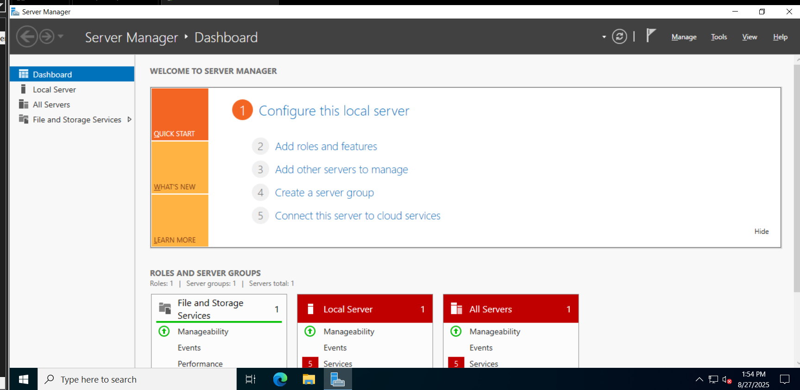
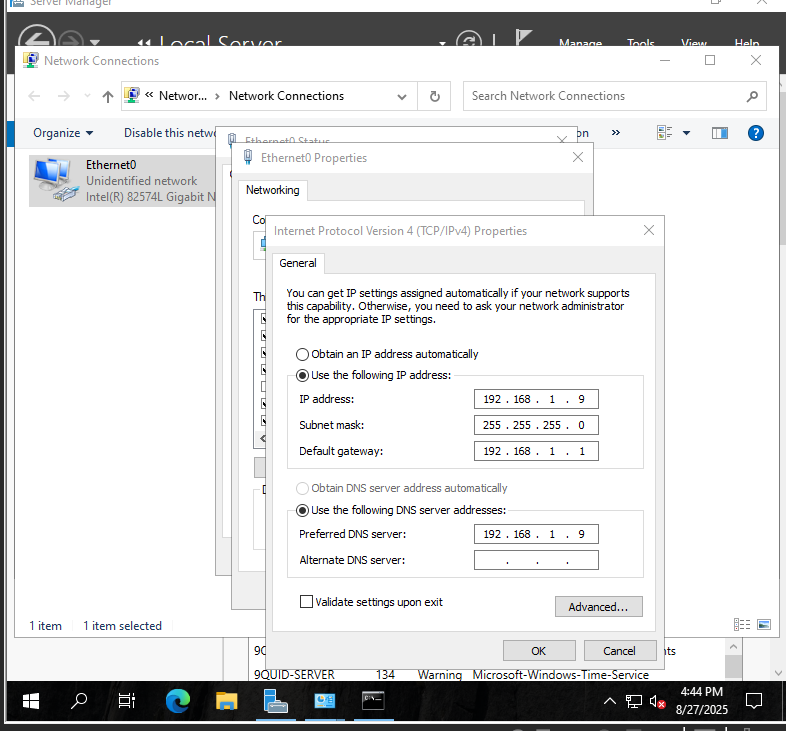
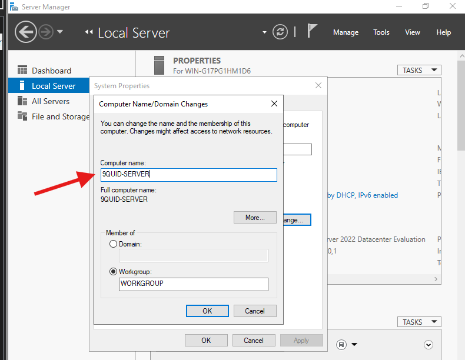

# Server-Setup

## Introduction

In this lab, I set up Windows Server 2022 on VMware Workstation, configured basic server settings such as hostname and static IP, and verified network connectivity in preparation for Active Directory deployment.

## Objectives

The goal of this lab was to install Windows Server 2022, configure initial settings, and confirm the server was ready for promotion to a Domain Controller.

### Step 1: Installed Windows Server 2022

- Firstly, I deployed windows server on VMware Workstation Pro and allocated `4 GB RAM`, `2 CPUs`, and *60 GB disk`.

**Figure Shows Resources allocated to Windows Server**

- Next, I installed Server 2022 Datacenter with Desktop Experience.

**Figure shows Windows Server 2022 installation with Desktop Experience selected.**

Then confirmed the set-up was complete.

**The first image shows the first login page and the second image shows the windows server dashboard respectively.**

### Step 2: Configure Network Interface

- `Set static IP`: **192.168.1.9**
- `Subnet mask`: **255.255.255.0**
- `Default Gateway`: **192.168.1.1**
- `Preferred DNS`: **192.168.1.9**

- I then confirmed configurations were applied by running ipconfig command.

**The first image shows the  NIC properties showing assigned static IP, subnet mask, gateway, and DNS and the second image shows IP configuration**

### Step 3: Rename Server & Join Domain Preparation

- Here, I renamed the server: `9Quid-Server`

#### Figure: Shows a new name for the Windows Server

- I verified network connectivity by pinging the DNS server and the loopback address.

**Figure shows Successfull ping to the loopback & DNS**

## Key Settings, Commands & Troubleshooting Notes

### Key Settings

- create a custom NAT if using VMware to ensure internet access after assigning a static ip address

- Rename your server and assign a static ip address before promoting it to a domain controller

- Take regular snapshots so you can easily rollback in case of system crashes or failures

## Useful Commands

### Check IP cconfiguration

- `ipconfig /all`

### Test DNS resolution

- `ping 192.168.1.9`

### Check loopback

- `ping 127.0.0.1`

### Restart after updates

- `Restart-Computer -Force`

## Troubleshooting Example

### Issue:

- Lost internet connection after assigning a static IP on the default NAT network.

### Resolution:

- I created a custom NAT network in VMware Workstation, then reconfigured the server’s NIC to use this new network. Internet access was restored while maintaining static IP addressing for the domain.

### Lessons Learned

- VMware’s Easy Install prompts for a license key, skip `ISO selection` during VM creation to avoid this.

- A snapshot-first approach prevents losing hours if AD setup fails.

- Using a custom NAT gives you control over addressing and avoids internet loss when static IPs are used.
