# osTicket Setup & Helpdesk Simulation

## Introduction

This lab demonstrates how to install and configure osTicket (an open-source ticketing system) on Windows Server 2022. The goal is to simulate a real IT support workflow, where users submit tickets and IT staff manage and resolve them. This provided me with hands-on experience with web application deployment, database setup, and IT service desk concepts.

### Prerequisites (brief)

- PHP 8.x — the server-side runtime that executes osTicket's code.
- MySQL — the relational database used to store tickets, users, and settings.
- osTicket (stable) — the PHP-based open‑source ticketing application being deployed.
- IIS with FastCGI — the web server configuration used in this lab.

## Objectives

The objective of this lab was to install and configure a database stack (PHP, MySQL), deploy osTicket and complete the initial setup wizard, Configure departments, help topics, and test agents. Simulate ticket submission and resolution,
practice documentation and troubleshooting of issues.

## Part A : Deployment and Configuration

## Step 1: Install PHP

- I downloaded PHP binaries `(Obtained the PHP 8.x NTS (Non-Thread Safe) x64 Zip package from php.net.)`, created folder `C:\PHP` and extracted files.

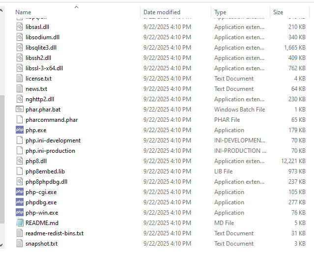

***The figure above shows PHP binaries extracted to C:\PHP***.

- Next, I configured `php.ini` by renaming the  `php.ini-production` to `php.ini`. Opened  `php.ini` in Notepad and enabled required extensions by uncommenting:

`extension=mysqli`
`extension=gd`
`extension=intl`
`extension=mbstring`
`extension=xml`
`extension=zip`

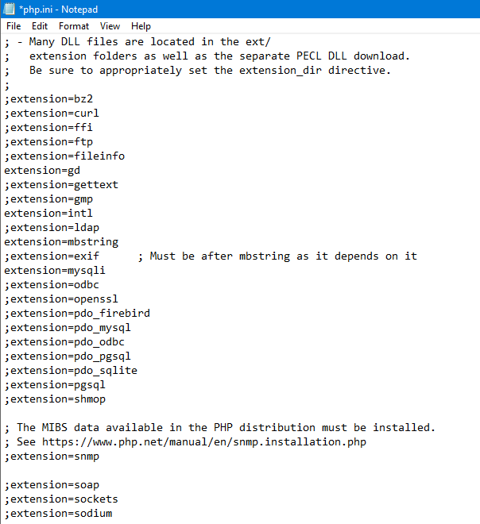

***The figure above shows php.ini configured with required extensions***.

- From there, I Added PHP to system PATH. Opened `System Properties` -> `Environment Variables` and edited `PATH`-> added `C:\PHP`.

- I then configured IIS Handler Mapping. I opened IIS Manager and selected Handler Mappings. Added Module Mapping -> Request Path: `*.php` -> Module: `FastCgiModule` -> Executable: `C:\PHP\php-cgi.exe` -> Name: `PHP_via_FastCGI`

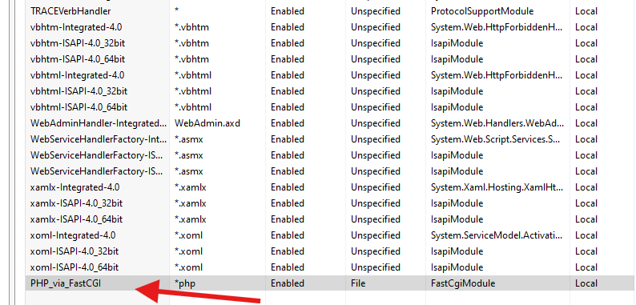

***The figure above shows PHP handler mapping in IIS***.

- Finally, I created file C:\inetpub\wwwroot\phpinfo.php, browsed to http://localhost/phpinfo.php and Verified PHP version and enabled extensions loaded.

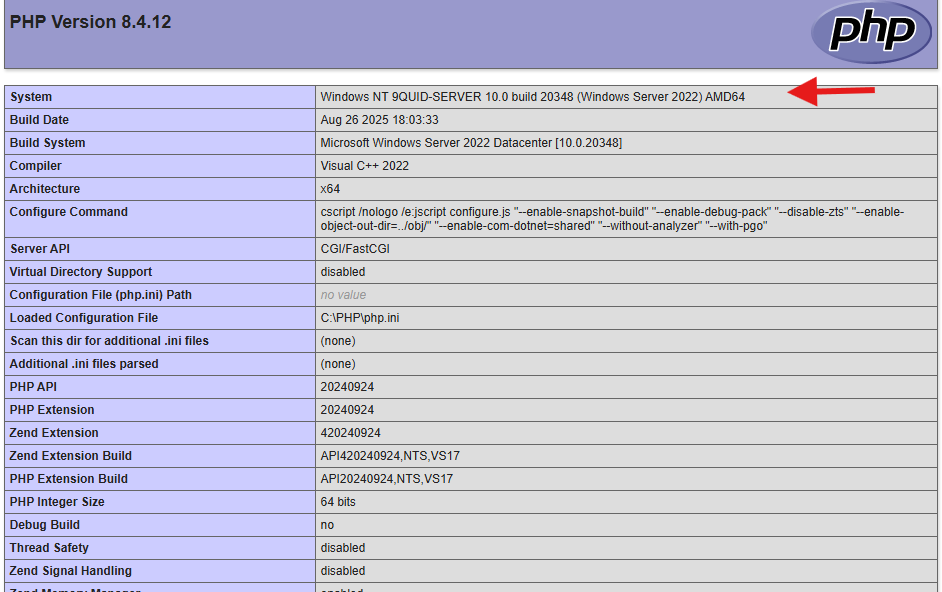

***The figure above shows PHP info page confirming PHP is working in IIS***.

**Step 2: Install MySQL**

Next, I downloaded MySQL Community Server, completed the installation and created a new database.

 - To create the database I ran `mysql -u root -p` in PowerShell. and entered my MySQL root password when prompted.

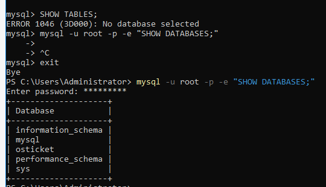

***The figure shows the database was created***

**Step3 Install osTicket**

- Next, I downloaded the latest osTicket (Stable) from the official site and extract to `C:\inetpub\wwwroot\osticket`.

- Next I added a new website in IIS called `osTicket` and pointed the path to `C:\inetpub\wwwroot\osticket\upload` then bound to HTTP (port 80).

- Finally gave `IIS_IUSRS` Modify permissions to `osticket\include\ost-config.php`. Navigated to the `http://localhost` and completed the osTicket installer.

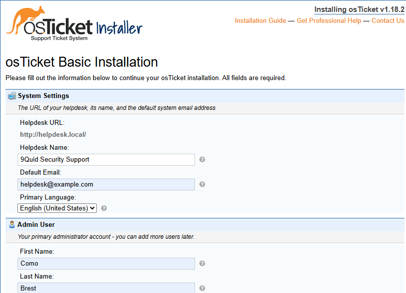

***The figure above shows the osticket installation wizard***

## Part B: Helpdesk Simulation

**Step 1: Configure Helpdesk Environment**

- Created Departments in osTicket: `IT Support`, `Networking`, `Systems`

- Created Help Topics: `Password Reset`, `Network Connectivity/Printer Issue`, `IT Support`

- Created Agents: `Admin (full control)`, `Helpdesk Tech (Level 1 permissions)`.

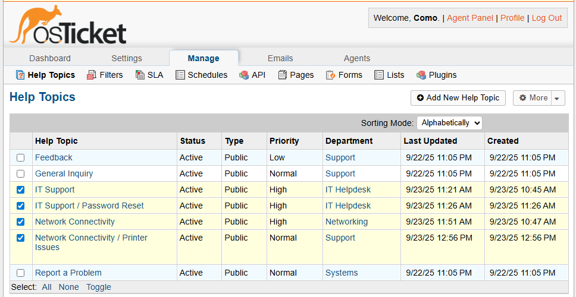

***The figure above shows Departments configured in osTicket***

**Step 2: Simulate User Ticket Submissions**

## Ticket 1

**1: Password Reset Ticket**

I submitted a test ticket as user `Hans Meier`;

- Help Topic: `IT Support/Password Reset`

- Subject: `Can’t log in to my account`

- Message: `Hi, I can’t log in to my computer. It says my password is incorrect. I think I forgot it. Can you reset it for me?`.

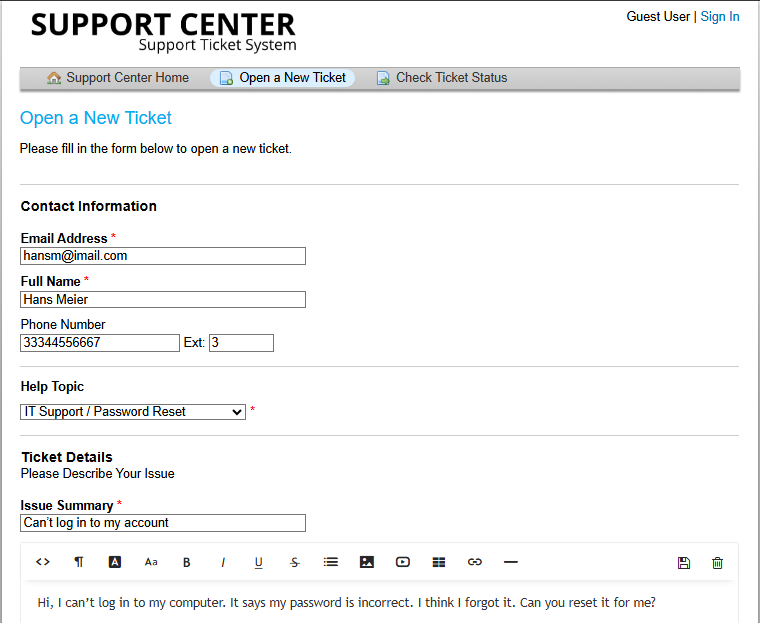

***The figure above shows a user submitting a password reset ticket***

Agent Response and Resolution:

I then logged in as an agent and responded the ticket submitted by the user, added internal notes and closed the ticket.

`Reply`: Hi Hans,
I’ve reset your password. Please try logging in with the temporary password provided. You’ll be asked to change it when you sign in. Let us know if you still have trouble.

`Internal note`: "Reset password in ADUC for user. Verified account is active. User will reset at next logon".

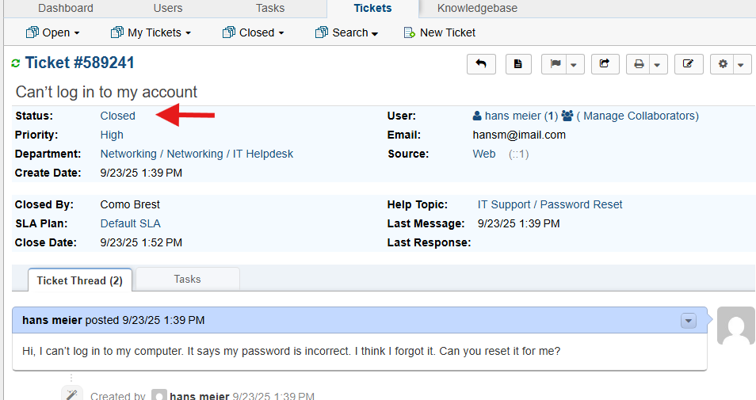

***The figure above shows the ticket resolved and closed***

## Ticket 2

**1: Printer Issue Ticket**

I submitted a test ticket as user `Gunner Gil`;

Help Topic: `Network Connectivity/Printer Issues`

Subject: `Printer not working`

Message: `The printer on Floor 2 isn’t printing anything. It shows as “offline.”`

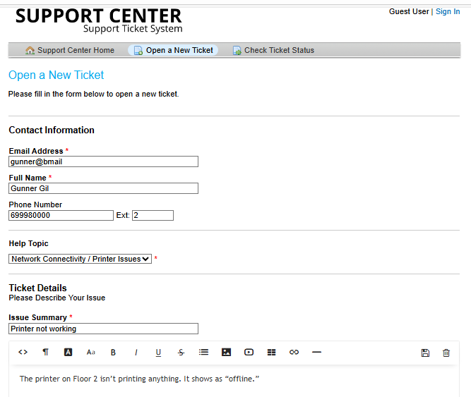

***The figure above shows user submitting a printer issue ticket***

Agent Response and Resolution:

- `Reply`: Hi Gunner,
We restarted the print service and cleared the print queue. Please try printing again and let us know if the issue persists.

- `Internal note`: Restarted Print Spooler service on print server. Cleared stuck job from the queue.

Ticket marked as Resolved and later Closed after user confirmation.

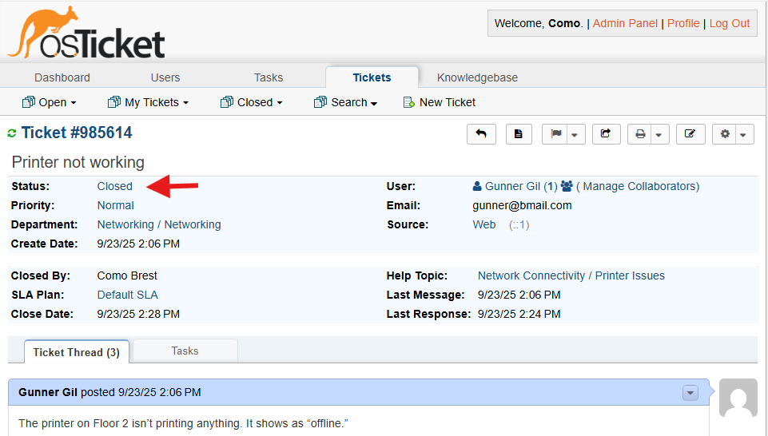

***The figure above shows ticket resolved and closed***

## Ticket 3

**Network Issue Ticket**

I submitted a test ticket as user `Carlos Alvarez`;

Help Topic: `Network Connectivity`

Subject: `No Network Access`

Message: `I can’t access the internet from my workstation. Other coworkers are fine.`

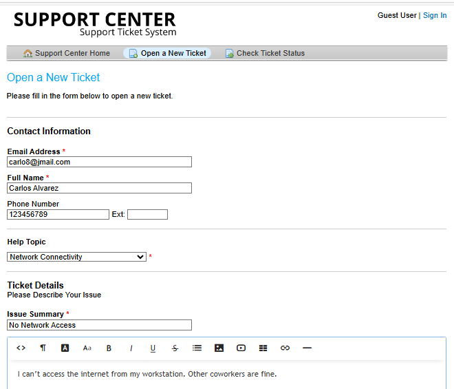

***The figure above shows a user submitting a networking ticket***

Agent Response and Resolution

`Reply`: Hi Carlos,
We checked your network connection and reset the switch port assigned to your workstation. Please try reconnecting and let us know if the issue is resolved.

`Internal note`: Verified link light on switch. Disabled/re-enabled port 12 on switch. User confirmed connectivity restored.

Ticket marked as Closed after user confirmation.

***The figure above shows the network ticket closed after resolution***

## Issues Encountered & Fixes

**1: IIS showing 404 / “can’t reach page”**

- Cause: Default Web Site stopped, custom site bindings not resolving.

- Fix: Verified bindings and hosts file. Added correct hostname to `C:\Windows\System32\drivers\etc\hosts`.

**2: PHP pages not loading**

- Cause: `FastCGI mapping/handler` configuration missing or incomplete.

- Fix: Checked PHP handler mapping `(*.php → C:\PHP\php-cgi.exe)` and FastCGI entry. Confirmed php-cgi.exe works with php-cgi.exe -v.

**3: 403.14 – Directory listing denied**

- Cause: IIS didn’t know index.php should be a default doc.

- Fix: Added index.php in IIS Default Document list.

**4: PHP page not loading in osTicket folder**

- Cause: IIS_IUSRS and Users group lacked write permissions.

- Fix: Granted Read/Write/Execute permissions to site folder -> installer loaded.

## Key Settings

**1: IIS Integration**

- Added PHP as a FastCGI handler `(php-cgi.exe)`.

- Configured IIS site for osTicket under `C:\inetpub\wwwroot\osticket`.

- Adjusted NTFS permissions for IUSR / NETWORK SERVICE on osTicket folders.

**2: Database**

- Created a dedicated MySQL/MariaDB database `(osticket_d)` and user with proper privileges.

- Confirmed DB connectivity during osTicket setup wizard.

**3: osTicket Setup**

- Uploaded the `upload/` folder to web root.

- Ran initial setup wizard at `http://localhost/osticket/setup`.

- Configured departments, help topics, and test agents/users.

## Useful PowerShell / IIS Commands

- Check IIS site list:

Get-Website

- Check site bindings:

Get-WebBinding

- Check PHP handler mapping:

Get-WebConfigurationProperty -Filter "system.webServer/handlers/add" -PSPath "IIS:\" | Where-Object {$_.path -like "*.php"}

- Check FastCGI apps:

Get-WebConfiguration -pspath 'MACHINE/WEBROOT/APPHOST' -filter "system.webServer/fastCgi/application" | 
Select-Object fullPath, arguments, monitorChangesTo

- Restart IIS:

iisreset

- Test if hostname resolves:

ping helpdesk.local

## Lessons Learned

- `Layered Dependencies`: Web apps like osTicket depend on correct setup of web server (IIS), scripting runtime (PHP), and database (MySQL/MariaDB). A misconfiguration in any layer can block deployment.

- `NTFS Permissions:` IIS apps need carefully scoped file/folder permissions — too restrictive breaks functionality, too broad is a security risk.

- `Troubleshooting Workflow`: Logs (IIS logs, PHP errors, MySQL logs) are essential in narrowing down misconfigurations.

- `Helpdesk Flow Understanding`: Beyond installation, osTicket demonstrates ITIL-like practices — tickets move through a lifecycle (open -> assigned -> resolved -> closed).