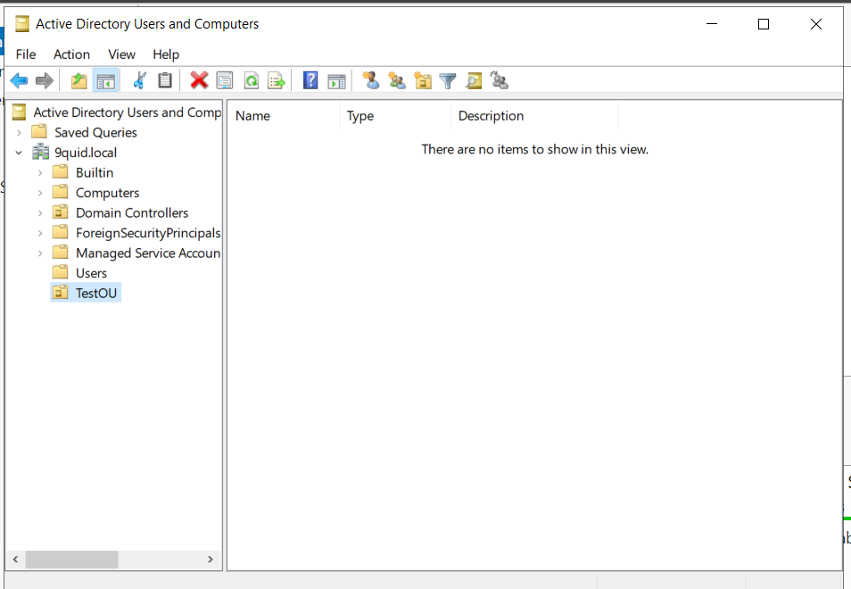
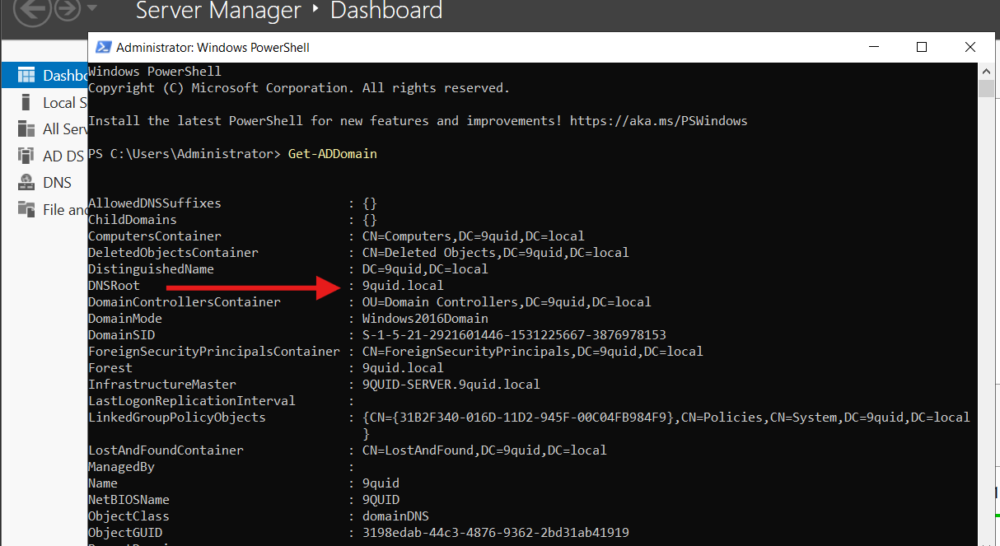

# 1. Active Directory Domain services set-up

## 🎯 Objectives

- Install Active Directory Domain Services (AD DS) role on Windows Server 2022.
- Promote the server to a Domain Controller.
- Test Domain Controller functionality.

## Steps and Walkthroughs

### Step 1 – Install Roles & Features

- Opened Server Manager, clicked on **Manage** selected **Add Roles and Features**

**Figure 01:** added roles and features

- Then completed the wizard and installed **AD DS**

**Figure 02:** Shows the completed installation of AD DS

### Step 2 Promote Server to Domain Controller

After installing AD DS, I went on to promote the server to a Domain Controller.
> **Note:** At this stage, I took a snapshot of the system to preserve its current state before promotion.

**Figure 03:** server promotion

### Step 3 Verify Server has been promoted to Domain Controller

- At this stage after promoting the server to Domain Controller, the server rebooted and all modifications were applied successfully

**Figure 04:** shows server as a domain controller

### Step 4: Test Domain Controller Functionality

To ensure the Domain Controller is fully working , I created an Organizational Unit as seen below

**Figure 05:** shows a test OU

## Useful Commands

### Verify Domain Controller Installation (PowerShell)

- Get-ADDomain
- Get-ADForest

### Lessons Learned

- Snapshots are your best friend. Take regular snapshots to save rollback in case of any misconfigurations.

- DNS is tightly integrated: AD DS setup automatically installs/configures DNS, and allows promotion to be successfull.

After promotion a reboot is mandatory.

OU creation is a quick test. Creating an OU  is a simple way to confirm DC is working properly.

Patience during promotion. The wizard takes a while and can look stuck — but letting it finish is the way to go.
