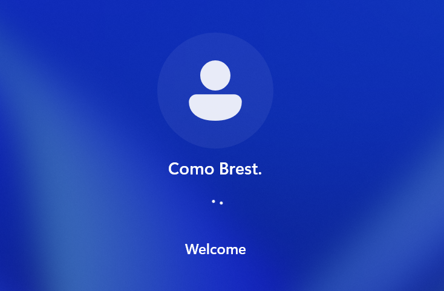
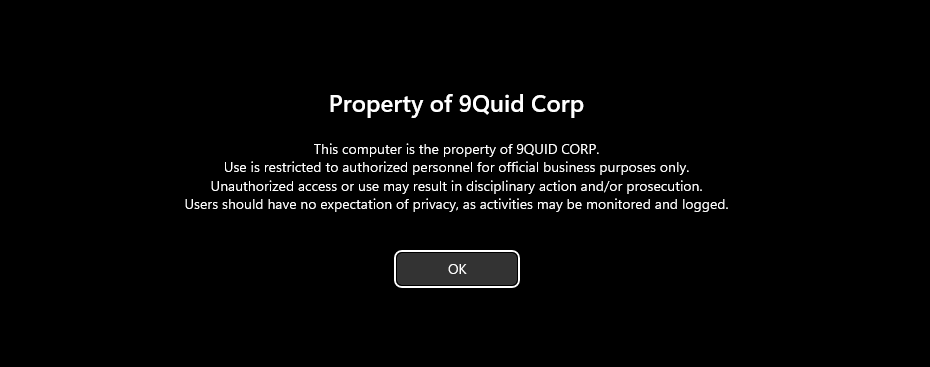

# 5.Windows Client Joining the Domain

## Introduction

In this lab, I installed a Windows 11 client, configure its network settings, and join it to the Active Directory domain. I then verified that domain user accounts could log in and that Group Policies were applied correctly.

**Domain Join:** The process of connecting a computer to an Active Directory domain so it becomes part of a centrally managed network.

## Objective

The goal of this lab was to join a Windows client machine to the Active Directory domain, verify that domain user accounts could log in, and confirm that Group Policies were applied successfully

### Step 1: Install Windows 11

- Installed Windows 11 Pro on VMware with 4 GB RAM, 2 CPUs, and 64 GB disk.

**The image shows the set-up in vmware**

- Next, I selected Windows 11 Pro for workstation

**The image shows the win11 version**

- I then completed the installation setup and confirmed the client booted successfully.

**Image shows win11 successully installed**

### Step 2: Configure Network Settings

- I configured DNS to point to 192.168.1.9 .

**image shows dns settings**

- I verified connectivity using ping 192.168.1.9 and ping 9quid.local.

**image shows successfull communication with DC**

### Step 3: Join Client to the Domain

- I opened System Properties → Changed Computer Name/Domain to `9Quid-11` → selected Domain.

**image shows successfull name change**

- I entered 9quid.local and authenticated with the Domain Admin account.

**image shows win11 has been joined successfully**

- I restarted the machine to complete the domain join.

### Step 4: Verify Domain Login

- At login screen, I selected Other user and signed in with domain account 9quid\cbrest.

- I confirmed the login was successful and profile created.

**image shows successfull log in**

### Step 5: Test Group Policy Application

- I ran gpupdate /force to refresh policies.

- I then confirmed that Control Panel restrictions and logon banner appeared as configured in previous chapters.

**Image shows group policy was applied successfully**

## 📝 Notes

## Active Directory Lab Networking Troubleshooting

This guide documents the networking issues I faced while setting up an **Active Directory (AD) lab** in VMware, how I troubleshooted them, and the final working solution.  

## The Initial Problem

I set up:

- A **Domain Controller (DC)** running AD DS, DNS, and DHCP.

- A **Windows client machine** joined to the domain.

At first:

- Both DC and client used a **NAT adapter**.

- The client got an IP from VMware’s NAT DHCP.

- I installed **DHCP on the DC** and disabled VMware’s DHCP.

This worked for a short while, but then the setup broke.  
To separate domain traffic from internet access, I added a **Host-Only adapter**.

## Issues I Faced

1. **Wrong IP Replies**  
   - The client could get an IP from the DC (good).  

   - But when pinging the DC by name, replies came from the DC’s *NAT IP* instead of the Host-Only IP.  

2. **One-Way Ping**  
   - The client could ping the DC.  

   - But the DC could not ping the client.  

3. **DNS Resolution Fails on Client**  
   - `nslookup` worked fine on the DC.  

   - On the client, name resolution failed or returned the NAT IP.

## How I Fixed It

### 1. Separate Roles for NICs

- **Host-Only adapter** → for AD, DNS, and DHCP.  

  - Static IP on the DC (e.g., `192.168.1.9`).  

  - Clients get IPs from this subnet.  

- **NAT adapter** → only for internet access.  

### 2. Stop NAT NIC from Registering in DNS

On the DC’s NAT NIC:

- Unchecked **“Register this connection’s addresses in DNS.”**  

- Deleted the NAT IP record from **DNS Manager**.  

- Configured DNS to **listen only on the Host-Only IP**.  

### 3. Configure DHCP Correctly

On the DC’s DHCP scope:

- Option **006 (DNS Server)** = Host-Only IP of DC.
- Option **015 (DNS Domain Name)** = domain name.

### 4. Refresh Clients

On the client, ran:

- cmd

- ipconfig /release

- ipconfig /flushdns

- ipconfig /renew

### 5 Adjust Network Metrics

To fix DNS resolution issues on the client, I manually adjusted the **network interface metrics**:

- **Host-Only adapter** → set metric to a **lower value** (e.g., `5`).

- **NAT adapter** → set metric to a **higher value** (e.g., `50`).  

This setting tells Windows:

- Always use the **Host-Only NIC first** for DNS and AD traffic.
  
- Only use the **NAT NIC** when accessing the internet.  

 After making this change, `nslookup` on the client started working correctly.
